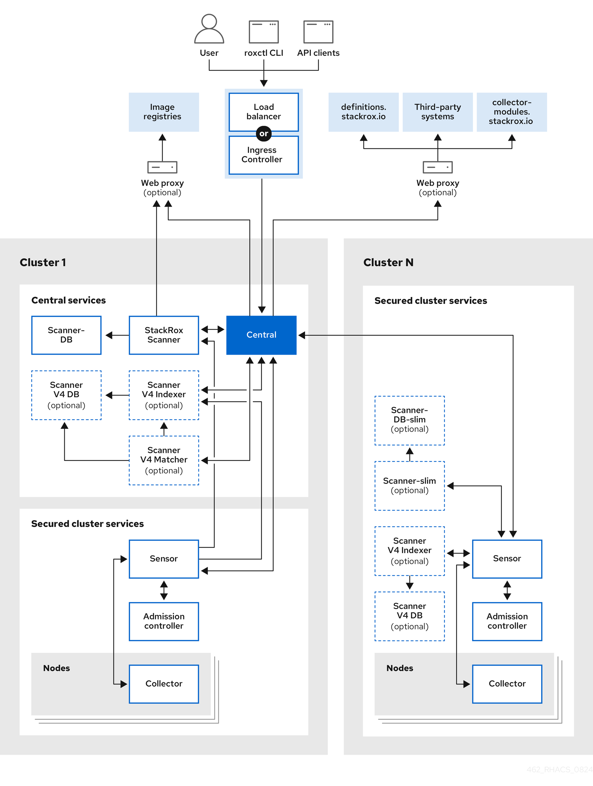

<!-- Format modified: converted from AsciiDoc to Markdown. See SOURCE.json for provenance. -->

Discover Red Hat Advanced Cluster Security for Kubernetes (RHACS) architecture and concepts.

# Red Hat Advanced Cluster Security for Kubernetes architecture overview

Red Hat Advanced Cluster Security for Kubernetes (RHACS) uses a distributed architecture that supports high-scale deployments and minimizes the impact on the underlying OpenShift Container Platform or Kubernetes nodes.

<figure>

</figure>

You install RHACS as a set of containers in your OpenShift Container Platform or Kubernetes cluster. RHACS includes the following services:

- Central services you install on one cluster

- Secured cluster services you install on each cluster you want to secure by RHACS

In addition to these primary services, RHACS also interacts with other external components to enhance your clusters' security.

When you install RHACS on OpenShift Container Platform by using the RHACS Operator, or on OpenShift Container Platform or any supported Kubernetes system by using Helm with the `secured-cluster-services` Helm chart, RHACS installs the StackRox Scanner and Scanner V4 components on every secured cluster. This enables the scanning of images in the integrated OpenShift image registry or in any registry that RHACS integrates with when delegated scanning is enabled. You can choose to not install the StackRox Scanner or Scanner V4 on the secured clusters and install them only on the cluster where Central is installed. For more information, see "Enabling Scanner V4".

Additional resources

- [External components](acs-architecture.md#external-components_acs-architecture)

- [Enabling Scanner V4](../operating/examine-images-for-vulnerabilities.md)

# Central services

Central services are the core management components of Red Hat Advanced Cluster Security for Kubernetes (RHACS). These services provide coordination and management for RHACS functionality, and handle the RHACS portal and API requests.

You install Central services on a single cluster. These services include the following components:

- **Central**: Central is the RHACS application management interface and services. It handles API interactions and user interface (RHACS Portal) access. You can use the same Central instance to secure multiple OpenShift Container Platform or Kubernetes clusters.

- **Central DB**: Central DB is the database for RHACS and handles all data persistence. It is currently based on PostgreSQL 13.

- **Scanner V4**: Beginning with version 4.4, RHACS contains the Scanner V4 vulnerability scanner for scanning container images. Scanner V4 is built on [Claircore](https://github.com/quay/claircore), which also powers the [Clair](https://github.com/quay/clair) scanner. Scanner V4 supports language and OS-specific image components, node, and platform scanning. Scanner V4 contains the Indexer, Matcher, and DB components.

  - **Scanner V4 Indexer**: The Scanner V4 Indexer performs image indexing, previously known as image analysis. Given an image and registry credentials, the Indexer pulls the image from the registry, finds the base operating system, if it exists, and looks for packages. The Indexer then stores and outputs an index report, which contains the findings for the given image.

  - **Scanner V4 Matcher**: The Scanner V4 Matcher performs vulnerability matching. If the Indexer that is installed in Central indexed the image, then the Matcher fetches the index report from the Indexer and matches the report with the vulnerabilities stored in the Scanner V4 database. If the Indexer that is installed in a Secured Cluster performed the indexing, then the Matcher uses the index report that was sent from that Indexer, and then matches against vulnerabilities. The Matcher also fetches vulnerability data and updates the Scanner V4 database with the latest vulnerability data. The Scanner V4 Matcher outputs a vulnerability report, which contains the final results of an image.

  - **Scanner V4 DB**: This database stores information for Scanner V4, including all vulnerability data and index reports. A persistent volume claim (PVC) is required for Scanner V4 DB on the cluster where Central is installed.

- **StackRox Scanner**: The StackRox Scanner originates from a fork of the Clair v2 open source scanner and was the default scanner for RHACS before Scanner V4.

- **Scanner-DB**: This database contains data for the StackRox Scanner.

The RHACS scanner analyzes each image layer to determine the base operating system and identify programming language packages and packages that were installed by the operating system package manager. It matches the findings against known vulnerabilities from various vulnerability sources. In addition, it identifies vulnerabilities in the node’s operating system and platform.

## Vulnerability data sources

Sources for vulnerabilities depend on the scanner that is used in your system. RHACS contains two scanners: StackRox Scanner and Scanner V4. The StackRox Scanner is deprecated. Scanner V4 is the default image scanner.

\+

> [!NOTE]
> Although the StackRox Scanner is deprecated, it still must be enabled on the cluster where Central is installed due to software dependencies.

### Scanner V4 sources

Scanner V4 uses the following vulnerability sources:

[Red Hat VEX](https://security.access.redhat.com/data/csaf/v2/vex/)  
This source is used with release 4.6 and later. This source provides vulnerability data in [Vulnerability Exploitability eXchange(VEX)](https://docs.oasis-open.org/csaf/csaf/v2.0/os/csaf-v2.0-os.html#45-profile-5-vex) format. RHACS takes advantage of VEX benefits to significantly decrease the time needed for the initial loading of vulnerability data, and the space needed to store vulnerability data. VEX also provides improved accuracy over OVAL.

RHACS might list a different number of vulnerabilities when you are scanning with a RHACS version that uses OVAL, such as RHACS version 4.5, and a version that uses VEX, such as version 4.6. For example, RHACS no longer displays vulnerabilities with a status of "under investigation," while these vulnerabilities were included with previous versions that used OVAL data.

For containers from or built on top of containers from the Red Hat Ecosystem Catalog, RHACS provides an option to show only vulnerabilities from Red Hat’s VEX data. VEX data for Red Hat images is the most accurate because the Red Hat security team vets the vulnerabilities in those images and reports the results in VEX. Other vulnerability sources such as OSV can report vulnerabilities that Red Hat has determined are not applicable to the image. This can cause false positives in vulnerability results. Enabling the setting to use only VEX data for Red Hat images minimizes these false positives.

The option to use VEX data for Red Hat containers is disabled by default. To enable this option, in Scanner V4 Matcher, set the environment variable `ROX_SCANNER_V4_RED_HAT_LAYERS_RED_HAT_VULNS_ONLY` to `true`. Be aware that in rare instances, using this option can cause valid vulnerabilities to not appear in scan results, or false negatives. For example, Red Hat does not track vulnerabilities for products that have reached end of life. Also be aware that Red Hat’s VEX data is missing [accurate security data for many Middleware products](https://access.redhat.com/security/middleware_security_scanning_problem).

For more information about Red Hat security data, including information about the use of OVAL, Common Security Advisory Framework Version 2.0 (CSAF), and VEX, see [The future of Red Hat security data](https://www.redhat.com/en/blog/future-red-hat-security-data).

[OSV](https://osv.dev/)  
This is used for language-related vulnerabilities, such as Go, Java, JavaScript, Python, and Ruby. This source might provide vulnerability IDs other than CVE IDs for vulnerabilities, such as a GitHub Security Advisory (GHSA) ID.

> [!NOTE]
> RHACS uses the OSV database available at [OSV.dev](https://osv.dev/) under [Apache License 2.0](https://github.com/google/osv.dev/blob/master/LICENSE).

[NVD](https://nvd.nist.gov/)  
This is used for various purposes such as filling in information gaps when vendors do not provide information. For example, Alpine does not provide a description, CVSS score, severity, or published date.

> [!NOTE]
> This product uses the NVD API but is not endorsed or certified by the NVD.

Additional vulnerability sources  
- [Alpine Security Database](https://secdb.alpinelinux.org/)

- Data tracked in [Amazon Linux Security Center](https://alas.aws.amazon.com/index.html)

- [Debian Security Tracker](https://security-tracker.debian.org/tracker/data/json)

- [Oracle OVAL](https://linux.oracle.com/security/oval)

- [Photon OVAL](https://packages.vmware.com/photon/photon_oval_definitions/)

- [SUSE OVAL](https://support.novell.com/security/oval/)

- [Ubuntu OVAL](https://security-metadata.canonical.com/oval/)

- [StackRox](https://github.com/stackrox/stackrox/blob/master/scanner/updater/manual/vulns.go): The upstream StackRox project maintains a set of vulnerabilities that might not be discovered due to data formatting from other sources or absence of data.

Scanner V4 Indexer sources  
Scanner V4 indexer uses the following files to index Red Hat containers:

- [repository-to-cpe.json](https://security.access.redhat.com/data/metrics/repository-to-cpe.json): Maps RPM repositories to their related CPEs, which is required for matching vulnerabilities for RHEL-based images.

- [container-name-repos-map.json](https://security.access.redhat.com/data/metrics/container-name-repos-map.json): This matches container names to their respective repositories.

### StackRox Scanner sources

StackRox Scanner uses the following vulnerability sources:

- [Red Hat OVAL](https://access.redhat.com/security/data/oval/v2/) v2

- [Alpine Security Database](https://secdb.alpinelinux.org/)

- Data tracked in [Amazon Linux Security Center](https://alas.aws.amazon.com/index.html)

- [Debian Security Tracker](https://security-tracker.debian.org/tracker/data/json)

- [Ubuntu CVE Tracker](https://git.launchpad.net/ubuntu-cve-tracker/)

- [NVD](https://nvd.nist.gov/): This is used for various purposes such as filling in information gaps when vendors do not provide information. For example, Alpine does not provide a description, CVSS score, severity, or published date.

  > [!NOTE]
  > This product uses the NVD API but is not endorsed or certified by the NVD.

- [Linux manual entries](https://github.com/stackrox/scanner/blob/master/ext/vulnsrc/manual/manual.go) and [NVD manual entries](https://github.com/stackrox/scanner/blob/master/pkg/vulnloader/nvdloader/manual.go): The upstream StackRox project maintains a set of vulnerabilities that might not be discovered due to data formatting from other sources or absence of data.

- [repository-to-cpe.json](https://security.access.redhat.com/data/metrics/repository-to-cpe.json): Maps RPM repositories to their related CPEs, which is required for matching vulnerabilities for RHEL-based images.

# Secured cluster services

Install the secured cluster services on each cluster that you want to secure by using Red Hat Advanced Cluster Security for Kubernetes.

Secured cluster services include the following components:

- **Sensor**: Sensor is the service responsible for analyzing and monitoring the cluster. Sensor listens to the OpenShift Container Platform or Kubernetes API and Collector events to report the current state of the cluster. Sensor also triggers deploy-time and runtime violations based on RHACS policies. In addition, Sensor is responsible for all cluster interactions, such as applying network policies, initiating reprocessing of RHACS policies, and interacting with the Admission controller.

- **Admission controller**: The Admission controller prevents users from creating workloads that violate security policies in RHACS.

- **Collector**: Collector analyzes and monitors container activity on cluster nodes. It collects container runtime and network activity information and sends the collected data to Sensor.

- **Scanner V4**: Scanner V4 retrieves and scans images and indexes them. It is the default scanner for RHACS and contains the following components:

  - **Scanner V4 Indexer**: The Scanner V4 Indexer performs image indexing, previously known as image analysis. Given an image and registry credentials, the Indexer pulls the image from the registry. The Indexer finds the base operating system, if one exists, and looks for packages. It stores and outputs an index report, which contains the findings for the given image.

  - **Scanner V4 DB**: This database stores information for Scanner V4, including index reports. For best performance, configure a persistent volume claim (PVC) for Scanner V4 DB.

- **StackRox Scanner**: In Kubernetes, the secured cluster services include Scanner-slim as an optional component. However, on OpenShift Container Platform, RHACS installs a Scanner-slim version on each secured cluster to scan images in the OpenShift Container Platform integrated registry and optionally other registries.

- **Scanner-DB**: This database contains data for the StackRox Scanner.

  > [!NOTE]
  > When secured cluster services are installed on the same cluster as Central services and installed in the same namespace, secured cluster services do not deploy Scanner V4 components. Instead, it is assumed that Central services already include a deployment of Scanner V4.

# External components

Red Hat Advanced Cluster Security for Kubernetes (RHACS) interacts with different external components to provide additional features and functionality, such as CLI access to the system, access to image registries, data from vulnerability feeds, and integrations with third-party systems.

RHACS interacts with the following external components:

- **Third-party systems**: You can integrate RHACS with other systems such as CI/CD pipelines, event management (SIEM) systems, logging, email, and more.

- `roxctl`: `roxctl` is a command-line interface (CLI) for running commands on RHACS.

- **Image registries**: You can integrate RHACS with various image registries and use RHACS to scan and view images. RHACS automatically configures registry integrations for active images by using the image pull secrets discovered in secured clusters. However, for scanning inactive images, you must manually configure registry integrations.

- `definitions.stackrox.io`: RHACS aggregates the data from various vulnerability feeds at the `definitions.stackrox.io` endpoint and passes this information to Central. The feeds include general, National Vulnerability Database (NVD) data, and distribution-specific data, such as Alpine, Debian, and Ubuntu.

- `collector-modules.stackrox.io`: Central reaches out to `collector-modules.stackrox.io` to obtain supported kernel modules and passes on these modules to Collector.

# Interaction between the services

Red Hat Advanced Cluster Security for Kubernetes (RHACS) includes services that interact with each other to provide functionality such as image scanning, scanning indexing and matching, admission controller enforcement, and vulnerability updates.

| Component | Direction | Component | Description |
|----|----|----|----|
| Central | ⮂ | Scanner V4 Indexer | Central requests the Indexer to download and index (analyze) given images. This process results in an index report. Scanner V4 Indexer requests mapping files from Central that assist the indexing process. |
| Central | ⮂ | Scanner V4 Matcher | Central requests that the Scanner V4 Matcher match given images to known vulnerabilities. This process results in the final scan result: a vulnerability report. Scanner V4 Matcher requests the latest vulnerabilities from Central. |
| Sensor | ⮂ | Scanner V4 Indexer | `SecuredCluster` scanning is enabled by default in Red Hat OpenShift environments deployed by using the Operator or when delegated scanning is used. When `SecuredCluster` scanning is enabled, Sensor requests Scanner V4 to index images. Scanner V4 Indexer requests mapping files from Sensor that assist the indexing process unless Central exists in the same namespace. In that case, Central is contacted instead. |
| Scanner V4 Indexer | → | Image Registries | The Indexer pulls image metadata from registries to determine the layers of the image, and downloads each previously unindexed layer. |
| Scanner V4 Matcher | → | Scanner V4 Indexer | Scanner V4 Matcher requests the results of the image indexing, the index report, from the Indexer. It then uses the report to determine relevant vulnerabilities. This interaction occurs only when the image is indexed in the Central cluster. This interaction does not occur when Scanner V4 is matching vulnerabilities for images indexed in secured clusters. |
| Scanner V4 Indexer | → | Scanner V4 DB | The Indexer stores data related to the indexing results to ensure that image layers are only downloaded and indexed once. This prevents unnecessary network traffic and other resource utilization. |
| Scanner V4 Matcher | → | Scanner V4 DB | Scanner V4 Matcher stores all of its vulnerability data in the database and periodically updates this data. Scanner V4 indexer also queries this data as part of the vulnerability matching process. |
| Sensor | ⮂ | Central | There is bidirectional communication between Central and Sensor. Sensor polls Central periodically to download updates for the sensor bundle configuration. It also sends events for the observed activity for the secured cluster and observed policy violations. Central communicates with Sensor to force reprocessing of all deployments against enabled policies. |
| Collector | ⮂ | Sensor | Collector communicates with Sensor and sends all of the events to the respective Sensor for the cluster. On supported OpenShift Container Platform clusters, Collector analyzes the software packages installed on the nodes and sends them to Sensor so that Scanner can later scan them for vulnerabilities. Collector also requests missing drivers from Sensor. Sensor requests compliance scan results from Collector. Additionally, Sensor receives external Classless Inter-Domain Routing information from Central and pushes it to Collector. |
| Admission controller | ⮂ | Sensor | Sensors send the list of security policies to enforce to Admission controller. Admission controller sends security policy violation alerts to Sensor. Admission controller can also request image scans from Sensor when required. |
| Admission controller | ➞ | Central | It is not common; however, Admission controller can communicate with Central directly if the Central endpoint is known and Sensor is unavailable. |

RHACS with Scanner V4

| Component | Direction | Interacts with | Description |
|----|----|----|----|
| Central | ⮂ | Scanner | There is bidirectional communication between Central and Scanner. Central requests image scans from Scanner, and Scanner requests updates to its CVE database from Central. |
| Central | ➞ | `definitions.stackrox.io` | Central connects to the `definitions.stackrox.io` endpoint to receive the aggregated vulnerability information. |
| Central | ➞ | `collector-modules.stackrox.io` | Central downloads supported kernel modules from `collector-modules.stackrox.io`. |
| Central | ➞ | Image registries | Central queries the image registries to get image metadata. For example, to show Dockerfile instructions in the RHACS portal. |
| Scanner | ➞ | Image registries | Scanner pulls images from the image registry to identify vulnerabilities. |
| Sensor | ⮂ | Central | There is bidirectional communication between Central and Sensor. Sensor polls Central periodically for downloading updates for the sensor bundle configuration. It also sends events for the observed activity for the secured cluster and observed policy violations. Central communicates with Sensor to force reprocessing of all deployments against enabled policies. |
| Sensor | ⮂ | Scanner | Sensor can communicate with the lightweight Scanner installed in the secured cluster. This connection allows Sensor to access registries directly from the secured cluster in scenarios where Central might be unable to access them. Scanner requests updated data from Sensor, Sensor forwards these requests to Central, and Central downloads the requested data from `definitions.stackrox.io`. |
| Collector | ⮂ | Sensor | Collector communicates with Sensor and sends all of the events to the respective Sensor for the cluster. On supported OpenShift Container Platform clusters, Collector analyzes the software packages installed on the nodes and sends them to Sensor so that Scanner can later scan them for vulnerabilities. Collector also requests missing drivers from Sensor. Sensor requests compliance scan results from Collector. Additionally, Sensor receives external Classless Inter-Domain Routing information from Central and pushes it to Collector. |
| Admission controller | ⮂ | Sensor | Sensors send the list of security policies to enforce to Admission controller. Admission controller sends security policy violation alerts to Sensor. Admission controller can also request image scans from Sensor when required. |
| Admission controller | ➞ | Central | It is not common; however, Admission controller can communicate with Central directly if the Central endpoint is known and Sensor is unavailable. |

RHACS with the StackRox Scanner

# RHACS connection protocols and default ports

Components of Red Hat Advanced Cluster Security for Kubernetes (RHACS) use various default ports and connection protocols. Depending on your system and firewall configuration, you might need to configure your firewall to allow traffic on certain ports so that the components can connect to each other.

The following table provides default ports and protocols for some connections within RHACS and between RHACS and external components. This is helpful for configuring your firewall to allow inbound and outbound cluster traffic.

However, you might need more detailed information in some scenarios. For example, if your firewall is integrated in the cluster router, you might need to specify ports for connections that happen within one cluster but might be on different IP networks. In this scenario, you can use the RHACS network policy YAML files in your OpenShift Container Platform and Kubernetes clusters to determine connections and ports that you might need to configure.

<table>
<caption>RHACS connections between components</caption>
<colgroup>
<col style="width: 25%" />
<col style="width: 25%" />
<col style="width: 25%" />
<col style="width: 25%" />
</colgroup>
<thead>
<tr>
<th style="text-align: left;">Component or external entity</th>
<th style="text-align: left;">Connection type</th>
<th style="text-align: left;">Port</th>
<th style="text-align: left;">Additional information</th>
</tr>
</thead>
<tbody>
<tr>
<td style="text-align: left;">
Central and Scanner V4 Indexer
</td>
<td style="text-align: left;">
gRPC
</td>
<td style="text-align: left;">
8443
</td>
<td style="text-align: left;"></td>
</tr>
<tr>
<td style="text-align: left;">
Central and Sensor on secured cluster
</td>
<td style="text-align: left;"><ul>
<li>
TCP/HTTPS
</li>
<li>
gRPC
</li>
</ul></td>
<td style="text-align: left;">
443
</td>
<td style="text-align: left;">
Sensor and Central primarily communicate over a bidirectional gRPC stream, initiated by Sensor to Central’s port 443.
</td>
</tr>
<tr>
<td style="text-align: left;">
Central and user (CLI)
</td>
<td style="text-align: left;"><ul>
<li>
gRPC
</li>
<li>
HTTPS (with <code>--force-http1</code> option)
</li>
</ul></td>
<td style="text-align: left;">
443
</td>
<td style="text-align: left;">
For more information about the <code>--force-http1</code> option, see the <code>roxctl</code> command options.
</td>
</tr>
<tr>
<td style="text-align: left;">
Central and vulnerability feeds
</td>
<td style="text-align: left;">
HTTPS
</td>
<td style="text-align: left;">
443
</td>
<td style="text-align: left;">
Connects to <code>definitions.stackrox.io</code> by default.
</td>
</tr>
<tr>
<td style="text-align: left;">
Collector to Sensor
</td>
<td style="text-align: left;">
gRPC
</td>
<td style="text-align: left;">
443
</td>
<td style="text-align: left;">
This is a bidirectional gRPC connection initiated by Collector to Sensor’s port 443.
</td>
</tr>
<tr>
<td style="text-align: left;">
Collector (Compliance) to Sensor
</td>
<td style="text-align: left;">
gRPC
</td>
<td style="text-align: left;">
8444
</td>
<td style="text-align: left;">
If node scanning is enabled on OpenShift Container Platform release 4, this connection is initiated by Sensor to compliance running in the Collector pod.
</td>
</tr>
<tr>
<td style="text-align: left;">
Scanner to Scanner-DB
</td>
<td style="text-align: left;">
TCP
</td>
<td style="text-align: left;">
5432
</td>
<td style="text-align: left;"></td>
</tr>
<tr>
<td style="text-align: left;">
Scanner V4 Indexer to Central
</td>
<td style="text-align: left;">
HTTPS
</td>
<td style="text-align: left;">
443
</td>
<td style="text-align: left;"></td>
</tr>
<tr>
<td style="text-align: left;">
Scanner V4 Indexer and Matcher to Scanner V4 DB
</td>
<td style="text-align: left;">
TCP
</td>
<td style="text-align: left;">
5432
</td>
<td style="text-align: left;"></td>
</tr>
<tr>
<td style="text-align: left;">
Sensor and Admission Controller
</td>
<td style="text-align: left;">
gRPC
</td>
<td style="text-align: left;">
443
</td>
<td style="text-align: left;">
This is a bidirectional gRPC stream, initiated by Admission Controller to Sensor’s port 443. This occurs in delegated scanning scenarios or in OpenShift Container Platform secured clusters.
</td>
</tr>
</tbody>
</table>

Additional resources

- [Installing Central with an external database using the Operator method](../installing/installing_ocp/install-central-ocp.md#install-central-operator-external-db_install-central-ocp)

- [roxctl command options](../cli/command-reference/roxctl.md#roxctl-command-options_roxctl)

