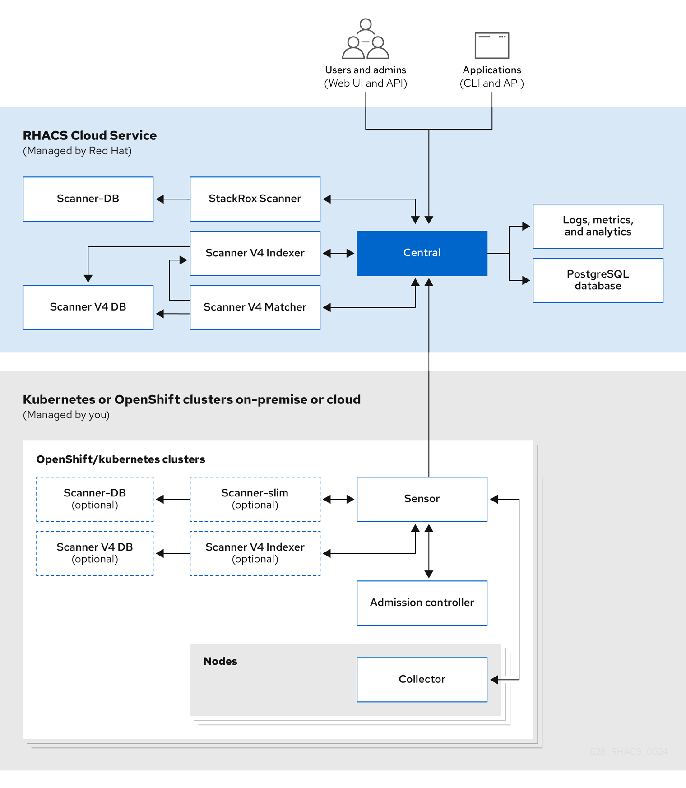

<!-- Format modified: converted from AsciiDoc to Markdown. See SOURCE.json for provenance. -->

Discover Red Hat Advanced Cluster Security Cloud Service (RHACS Cloud Service) architecture and concepts.

# Red Hat Advanced Cluster Security Cloud Service architecture overview

Red Hat Advanced Cluster Security Cloud Service (RHACS Cloud Service) is a Red Hat managed Software-as-a-Service (SaaS) platform you can use to protect your Kubernetes and OpenShift Container Platform clusters and applications throughout the build, deploy, and runtime lifecycles. The system architecture includes the cloud services, which are managed by Red Hat, and the secured OpenShift Container Platform or Kubernetes clusters, either on-premise or in the cloud, that are managed by you.

RHACS Cloud Service includes many built-in DevOps enforcement controls and security-focused best practices based on industry standards such as the Center for Internet Security (CIS) benchmarks and the National Institute of Standards Technology (NIST) guidelines. You can also integrate it with your existing DevOps tools and workflows to improve security and compliance.

The following graphic shows the architecture with the StackRox Scanner and Scanner V4.

<figure>

</figure>

Central services include the user interface (UI), data storage, RHACS application programming interface (API), and image scanning capabilities. You deploy your Central service through the [Red Hat Hybrid Cloud Console.](https://console.redhat.com/) When you create a new ACS instance, Red Hat creates your individual control plane for RHACS.

RHACS Cloud Service allows you to secure self-managed clusters that communicate with a Central instance. The clusters you secure, called Secured Clusters, are managed by you, and not by Red Hat. Secured Cluster services include optional vulnerability scanning services, admission control services, and data collection services used for runtime monitoring and compliance. You install Secured Cluster services on any OpenShift or Kubernetes cluster you want to secure.

When you install RHACS on OpenShift Container Platform by using the RHACS Operator, or on OpenShift Container Platform or any supported Kubernetes system by using Helm with the `secured-cluster-services` Helm chart, RHACS installs the StackRox Scanner and Scanner V4 components on every secured cluster. This enables the scanning of images in the integrated OpenShift image registry or in any registry that RHACS integrates with when delegated scanning is enabled. You can choose to not install the StackRox Scanner or Scanner V4 on the secured clusters and install them only on the cluster where Central is installed. For more information, see "Enabling Scanner V4".

Additional resources

- [Enabling Scanner V4](../operating/examine-images-for-vulnerabilities.md#scannerv4-enabling_examine-images-for-vulnerabilities)

# Central

Red Hat manages Central, the control plane for Red Hat Advanced Cluster Security for Kubernetes (RHACS Cloud Service). These services include the following components:

- **Central**: Central is the RHACS application management interface and services. It handles API interactions and user interface (RHACS Portal) access. You can use the same Central instance to secure multiple OpenShift Container Platform or Kubernetes clusters.

- **Central DB**: Central DB is the database for RHACS and handles all data persistence. It is currently based on PostgreSQL 13.

- **Scanner V4**: Beginning with version 4.4, RHACS contains the Scanner V4 vulnerability scanner for scanning container images. Scanner V4 is built on [Claircore](https://github.com/quay/claircore), which also powers the [Clair](https://github.com/quay/clair) scanner. Scanner V4 supports language and OS-specific image components, node, and platform scanning. Scanner V4 contains the Indexer, Matcher, and DB components.

  - **Scanner V4 Indexer**: The Scanner V4 Indexer performs image indexing, previously known as image analysis. Given an image and registry credentials, the Indexer pulls the image from the registry, finds the base operating system, if it exists, and looks for packages. The Indexer then stores and outputs an index report, which contains the findings for the given image.

  - **Scanner V4 Matcher**: The Scanner V4 Matcher performs vulnerability matching. If the Indexer that is installed in Central indexed the image, then the Matcher fetches the index report from the Indexer and matches the report with the vulnerabilities stored in the Scanner V4 database. If the Indexer that is installed in a Secured Cluster performed the indexing, then the Matcher uses the index report that was sent from that Indexer, and then matches against vulnerabilities. The Matcher also fetches vulnerability data and updates the Scanner V4 database with the latest vulnerability data. The Scanner V4 Matcher outputs a vulnerability report, which contains the final results of an image.

  - **Scanner V4 DB**: This database stores information for Scanner V4, including all vulnerability data and index reports. A persistent volume claim (PVC) is required for Scanner V4 DB on the cluster where Central is installed.

- **StackRox Scanner**: The StackRox Scanner originates from a fork of the Clair v2 open source scanner and was the default scanner for RHACS before Scanner V4.

- **Scanner-DB**: This database contains data for the StackRox Scanner.

The RHACS scanner analyzes each image layer to determine the base operating system and identify programming language packages and packages that were installed by the operating system package manager. It matches the findings against known vulnerabilities from various vulnerability sources. In addition, it identifies vulnerabilities in the node’s operating system and platform.

## Vulnerability data sources

Sources for vulnerabilities depend on the scanner that is used in your system. RHACS contains two scanners: StackRox Scanner and Scanner V4. The StackRox Scanner is deprecated. Scanner V4 is the default image scanner.

\+

> [!NOTE]
> Although the StackRox Scanner is deprecated, it still must be enabled on the cluster where Central is installed due to software dependencies.

### Scanner V4 sources

Scanner V4 uses the following vulnerability sources:

[Red Hat VEX](https://security.access.redhat.com/data/csaf/v2/vex/)  
This source is used with release 4.6 and later. This source provides vulnerability data in [Vulnerability Exploitability eXchange(VEX)](https://docs.oasis-open.org/csaf/csaf/v2.0/os/csaf-v2.0-os.html#45-profile-5-vex) format. RHACS takes advantage of VEX benefits to significantly decrease the time needed for the initial loading of vulnerability data, and the space needed to store vulnerability data. VEX also provides improved accuracy over OVAL.

RHACS might list a different number of vulnerabilities when you are scanning with a RHACS version that uses OVAL, such as RHACS version 4.5, and a version that uses VEX, such as version 4.6. For example, RHACS no longer displays vulnerabilities with a status of "under investigation," while these vulnerabilities were included with previous versions that used OVAL data.

For containers from or built on top of containers from the Red Hat Ecosystem Catalog, RHACS provides an option to show only vulnerabilities from Red Hat’s VEX data. VEX data for Red Hat images is the most accurate because the Red Hat security team vets the vulnerabilities in those images and reports the results in VEX. Other vulnerability sources such as OSV can report vulnerabilities that Red Hat has determined are not applicable to the image. This can cause false positives in vulnerability results. Enabling the setting to use only VEX data for Red Hat images minimizes these false positives.

The option to use VEX data for Red Hat containers is disabled by default. To enable this option, in Scanner V4 Matcher, set the environment variable `ROX_SCANNER_V4_RED_HAT_LAYERS_RED_HAT_VULNS_ONLY` to `true`. Be aware that in rare instances, using this option can cause valid vulnerabilities to not appear in scan results, or false negatives. For example, Red Hat does not track vulnerabilities for products that have reached end of life. Also be aware that Red Hat’s VEX data is missing [accurate security data for many Middleware products](https://access.redhat.com/security/middleware_security_scanning_problem).

For more information about Red Hat security data, including information about the use of OVAL, Common Security Advisory Framework Version 2.0 (CSAF), and VEX, see [The future of Red Hat security data](https://www.redhat.com/en/blog/future-red-hat-security-data).

[OSV](https://osv.dev/)  
This is used for language-related vulnerabilities, such as Go, Java, JavaScript, Python, and Ruby. This source might provide vulnerability IDs other than CVE IDs for vulnerabilities, such as a GitHub Security Advisory (GHSA) ID.

> [!NOTE]
> RHACS uses the OSV database available at [OSV.dev](https://osv.dev/) under [Apache License 2.0](https://github.com/google/osv.dev/blob/master/LICENSE).

[NVD](https://nvd.nist.gov/)  
This is used for various purposes such as filling in information gaps when vendors do not provide information. For example, Alpine does not provide a description, CVSS score, severity, or published date.

> [!NOTE]
> This product uses the NVD API but is not endorsed or certified by the NVD.

Additional vulnerability sources  
- [Alpine Security Database](https://secdb.alpinelinux.org/)

- Data tracked in [Amazon Linux Security Center](https://alas.aws.amazon.com/index.html)

- [Debian Security Tracker](https://security-tracker.debian.org/tracker/data/json)

- [Oracle OVAL](https://linux.oracle.com/security/oval)

- [Photon OVAL](https://packages.vmware.com/photon/photon_oval_definitions/)

- [SUSE OVAL](https://support.novell.com/security/oval/)

- [Ubuntu OVAL](https://security-metadata.canonical.com/oval/)

- [StackRox](https://github.com/stackrox/stackrox/blob/master/scanner/updater/manual/vulns.go): The upstream StackRox project maintains a set of vulnerabilities that might not be discovered due to data formatting from other sources or absence of data.

Scanner V4 Indexer sources  
Scanner V4 indexer uses the following files to index Red Hat containers:

- [repository-to-cpe.json](https://security.access.redhat.com/data/metrics/repository-to-cpe.json): Maps RPM repositories to their related CPEs, which is required for matching vulnerabilities for RHEL-based images.

- [container-name-repos-map.json](https://security.access.redhat.com/data/metrics/container-name-repos-map.json): This matches container names to their respective repositories.

### StackRox Scanner sources

StackRox Scanner uses the following vulnerability sources:

- [Red Hat OVAL](https://access.redhat.com/security/data/oval/v2/) v2

- [Alpine Security Database](https://secdb.alpinelinux.org/)

- Data tracked in [Amazon Linux Security Center](https://alas.aws.amazon.com/index.html)

- [Debian Security Tracker](https://security-tracker.debian.org/tracker/data/json)

- [Ubuntu CVE Tracker](https://git.launchpad.net/ubuntu-cve-tracker/)

- [NVD](https://nvd.nist.gov/): This is used for various purposes such as filling in information gaps when vendors do not provide information. For example, Alpine does not provide a description, CVSS score, severity, or published date.

  > [!NOTE]
  > This product uses the NVD API but is not endorsed or certified by the NVD.

- [Linux manual entries](https://github.com/stackrox/scanner/blob/master/ext/vulnsrc/manual/manual.go) and [NVD manual entries](https://github.com/stackrox/scanner/blob/master/pkg/vulnloader/nvdloader/manual.go): The upstream StackRox project maintains a set of vulnerabilities that might not be discovered due to data formatting from other sources or absence of data.

- [repository-to-cpe.json](https://security.access.redhat.com/data/metrics/repository-to-cpe.json): Maps RPM repositories to their related CPEs, which is required for matching vulnerabilities for RHEL-based images.

# Secured cluster services

Install the secured cluster services on each cluster that you want to secure by using Red Hat Advanced Cluster Security Cloud Service.

Secured cluster services include the following components:

- **Sensor**: Sensor is the service responsible for analyzing and monitoring the cluster. Sensor listens to the OpenShift Container Platform or Kubernetes API and Collector events to report the current state of the cluster. Sensor also triggers deploy-time and runtime violations based on RHACS Cloud Service policies. In addition, Sensor is responsible for all cluster interactions, such as applying network policies, initiating reprocessing of RHACS Cloud Service policies, and interacting with the Admission controller.

- **Admission controller**: The Admission controller prevents users from creating workloads that violate security policies in RHACS Cloud Service.

- **Collector**: Collector analyzes and monitors container activity on cluster nodes. It collects container runtime and network activity information and sends the collected data to Sensor.

- **Scanner V4**: Scanner V4 retrieves and scans images and indexes them. It is the default scanner for RHACS and contains the following components:

  - **Scanner V4 Indexer**: The Scanner V4 Indexer performs image indexing, previously known as image analysis. Given an image and registry credentials, the Indexer pulls the image from the registry. The Indexer finds the base operating system, if one exists, and looks for packages. It stores and outputs an index report, which contains the findings for the given image.

  - **Scanner V4 DB**: This database stores information for Scanner V4, including index reports. For best performance, configure a persistent volume claim (PVC) for Scanner V4 DB.

- **StackRox Scanner**: In Kubernetes, the secured cluster services include Scanner-slim as an optional component. However, on OpenShift Container Platform, RHACS Cloud Service installs a Scanner-slim version on each secured cluster to scan images in the OpenShift Container Platform integrated registry and optionally other registries.

- **Scanner-DB**: This database contains data for the StackRox Scanner.

  > [!NOTE]
  > When secured cluster services are installed on the same cluster as Central services and installed in the same namespace, secured cluster services do not deploy Scanner V4 components. Instead, it is assumed that Central services already include a deployment of Scanner V4.

Additional resources

- [External components](../architecture/acs-architecture.md#external-components_acs-architecture)

# Data access and permissions

Red Hat does not have access to the clusters on which you install the secured cluster services. Also, RHACS Cloud Service does not need permission to access the secured clusters. For example, you do not need to create new IAM policies, access roles, or API tokens.

However, RHACS Cloud Service stores the data that secured cluster services send. All data is encrypted within RHACS Cloud Service. Encrypting the data within the RHACS Cloud Service platform helps to ensure the confidentiality and integrity of the data.

When you install secured cluster services on a cluster, it generates data and transmits it to the RHACS Cloud Service. This data is kept secure within the RHACS Cloud Service platform, and only authorized SRE team members and systems can access this data. RHACS Cloud Service uses this data to monitor the security and compliance of your cluster and applications, and to provide valuable insights and analytics that can help you optimize your deployments.
