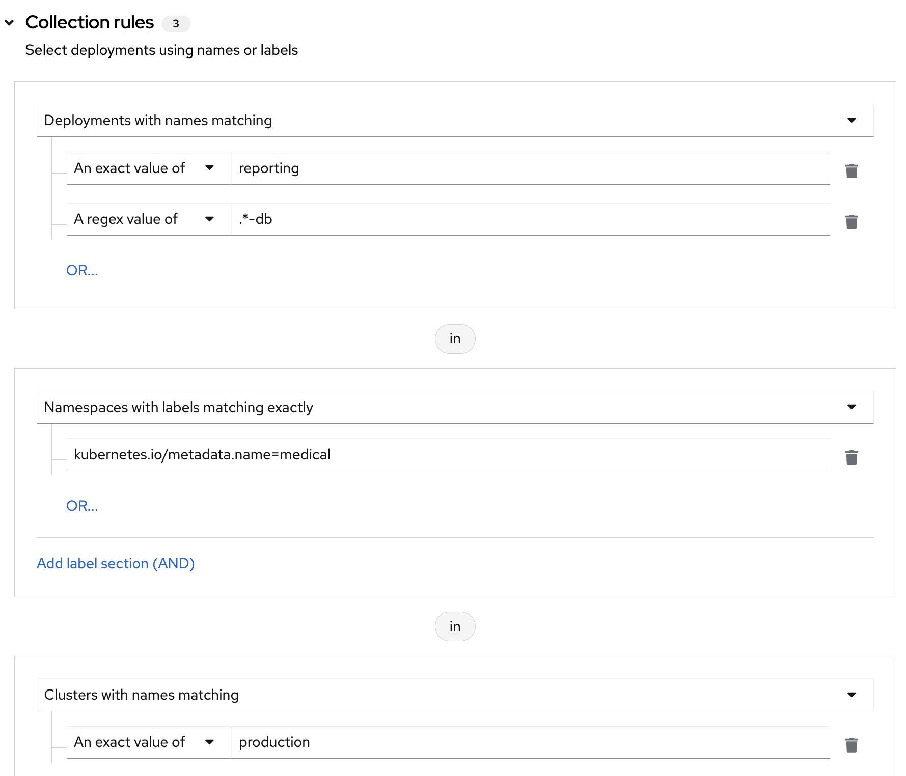
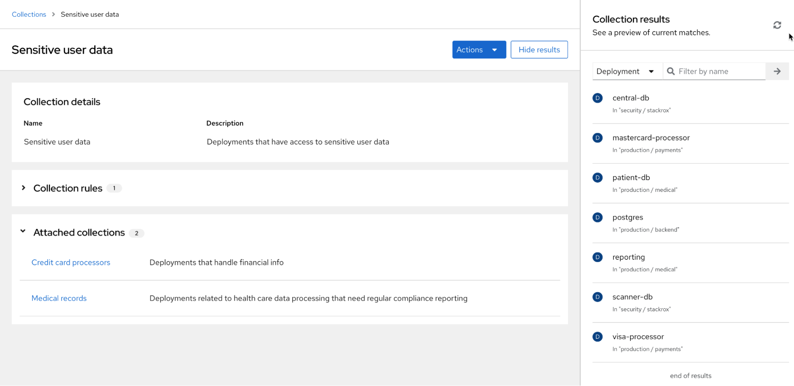

<!-- Format modified: converted from AsciiDoc to Markdown. See SOURCE.json for provenance. -->

You can use collections in RHACS to define and name a group of resources by using matching patterns. You can then configure system processes to use these collections.

Currently, collections are available only under the following conditions:

- Collections are available only for deployments.

- You can only use collections with vulnerability reporting. See "Vulnerability reporting" in the Additional resources section for more information.

- Deployment collections are only available to RHACS customers if they are using the PostgreSQL database.

  > [!NOTE]
  > By default, RHACS Cloud Service uses the PostgreSQL database, and it is also used by default when installing RHACS release 4.0 and later. RHACS customers using an earlier release than 3.74 can migrate to the PostgreSQL database with help from Red Hat.

# Prerequisites

A user account must have the following permissions to use the Collections feature:

- `WorkflowAdministration`: You must have **Read** access to view collections and **Write** access to add, change, or delete collections.

- `Deployment`: You need **Read Access** or **Read and Write Access** to understand how configured rules will match with deployments.

These permissions are included in the `Admin` system role. For more information about roles and permissions, see "Managing RBAC in RHACS" in "Additional resources".

# Understanding deployment collections

Deployment collections are only available to RHACS customers using the PostgreSQL database. By default, RHACS Cloud Service uses the PostgreSQL database, and it is also used by default when installing RHACS release 4.0 and later. RHACS customers using an earlier release than 3.74 can migrate to the PostgreSQL database with help from Red Hat.

An RHACS collection is a user-defined, named reference. It defines a logical grouping by using selection rules. Those rules can match a deployment, namespace, or cluster name or label. You can specify rules by using exact matches or regular expressions. Collections are resolved at run time and can refer to objects that do not exist at the time of the collection definition. Collections can be constructed by using other collections to describe complex hierarchies.

Collections provide you with a language to describe how your dynamic infrastructure is organized, eliminating the need for cloning and repetitive editing of RHACS properties such as inclusion and exclusion scopes.

You can use collections to identify any group of deployments in your system, such as:

- An infrastructure area that is owned by a specific development team

- An application that requires different policy exceptions when running in a development or in a production cluster

- A distributed application that spans multiple namespaces, defined with a common deployment label

- An entire production or test environment

Collections can be created and managed by using the RHACS portal. The collection editor helps you apply selection rules at the deployment, namespace, and cluster level. You can use simple and complex rules, including regular expressions. For regular expressions, [RE2 syntax](https://github.com/google/re2/wiki/Syntax) is supported. Perl syntax is not supported.

You can define a collection by selecting one or more deployments, namespaces, or clusters, as shown in the following image. This image shows a collection that contains deployments with the name `reporting` or that contain `db` in the name. The collection includes deployments matching those names in the namespace with a specific label of `kubernetes.io/metadata.name=medical`, and in clusters named `production`.

<figure>

</figure>

The collection editor also helps you to describe complex hierarchies by attaching, or nesting, other collections. The editor provides a real-time preview side panel that helps you understand the rules you are applying by showing the resulting matches to the rules that you have configured. The following image provides an example of results from a collection named "Sensitive User Data" with a set of collection rules (not shown). The "Sensitive User Data" collection has two attached collections, "Credit card processors" and "Medical records", and each of those collections has its own collection rules. The results shown in the side panel include items that match the rules configured for all three collections.

<figure>

</figure>

# Accessing deployment collections

Create, edit, clone, and delete deployment collections in Red Hat Advanced Cluster Security for Kubernetes (RHACS) by using the **Platform Configuration** → **Collections** page.

Procedure

- Click **Platform Configuration** → **Collections** to do any of the following actions:

  - To search for collections, enter text in the **Search by name** field, and then press the arrow icon.

  - To view the collection in read-only mode, click a collection name in the collection list.

  - To edit, clone, or delete a collection, locate the collection in the list and click the overflow menu .

    > [!NOTE]
    > You cannot delete a collection that is actively used in RHACS.

  - Click **Create collection** to create a new deployment collection.

# Creating deployment collections

When creating a collection, you must name it and define the rules for the collection.

Procedure

1.  In the Collections page, click **Create collection**.

2.  Enter the name and description for the collection.

3.  In the **Collection rules** section, you must perform at least one of the following actions:

    - Define the rules for the collection: See the "Creating collection rules" section for more information.

    - Attach existing collections to the collection: See the "Adding attached collections" section for more information.

4.  The results of your rule configuration or choosing attached collections are available in the **Collection results** live preview panel. Click **Hide results** to remove this panel from display.

5.  Click **Save**.

## Creating collection rules

When creating collections, you must configure at least one rule or attach another collection to the new collection that you are creating.

> [!NOTE]
> Currently, collections are available only for deployments.

Configure rules to select the resources to include in the collection. Use the preview panel to see the results of the collection rules as you configure them. You can configure rules in any order.

Procedure

1.  In the **Deployments** section, select one of the following options from the drop-down list:

    - **No deployments specified**: Select this option if you do not want to use the deployment criteria in your search.

    - **Deployments with names matching**: Select this option to choose by name and then select one of the following options:

      - **An exact value of**: Enter the exact name of the deployment.

      - **A regex value of**: You can use regular expressions to search for a deployment. This option is useful if you do not know the exact name of the deployment. A regular expression is a string of letters, numbers, and symbols that defines a pattern. RHACS uses this pattern to match characters or groups of characters and return results. For regular expressions, [RE2 syntax](https://github.com/google/re2/wiki/Syntax) is supported. Perl syntax is not supported. To select *all deployments*, select this option and enter `.*`. See "Using regular expressions" for more information and examples.

    - **Deployments with labels matching exactly**: Select this option to select deployments with labels that match the exact text that you enter. The label must be a valid Kubernetes label in the format of `key=value`.

2.  Optional: To add more deployments with names or labels that match additional criteria for inclusion, click **OR** and configure another exact or regular expression value.

### Using regular expressions

RHACS uses regular expressions in some areas of the portal, including when you configure collections to include or exclude deployments.

You can use regular expressions in some pages and fields when searching for specific items. For example, when configuring a collection, you can use regular expressions to search for a deployment. This option is useful if you do not know the exact name of the deployment. A regular expression is a string of letters, numbers, and symbols that defines a pattern. RHACS uses this pattern to match characters or groups of characters and return results. For regular expressions, note the following guidelines:

- [RE2 syntax](https://github.com/google/re2/wiki/Syntax) is supported.

- Perl syntax is not supported.

- Testing your regular expressions syntax is helpful, for example, by using a site such as <https://regex101.com/>. Select **Golang** as the flavor.

> [!NOTE]
> The following examples assume naming conventions are followed where production clusters contain the word `prod` in the name.

To create a collection of production clusters:

1.  In **Collection rules**, select **Clusters with names matching**.

2.  From the drop-down list, select **A regex value of** and enter the following text:

        ^prod.*

To create a collection of non-production clusters:

With RE2 syntax, you cannot match by using negative lookahead, meaning that you cannot direct regular expressions to match if an element is **not** present. As a workaround, you can use regular expressions to match when the word `prod` does not appear in the cluster name; that is, to match if the letters `p`, `r`, `o`, and `d` do not appear in sequence.

1.  In **Collection rules**, select **Clusters with names matching**.

2.  From the drop-down list, select **A regex value of** and enter the following text:

        ^[^p]*(p([^r]|$|r([^o]|$|o([^d]|$))))*[^p]*$

To create a collection that matches all entities in the cluster, namespace, and deployments hierarchy:

1.  In **Collection rules**, select **Deployments with names matching**.

    1.  From the drop-down list, select **A regex value of** and enter `.*`.

2.  Select **Namespaces with names matching**.

    1.  From the drop-down list, select **A regex value of** and enter `.*`.

3.  Select **Clusters with names matching**.

    1.  From the drop-down list, select **A regex value of** and enter `.*`.

To create a collection that includes a named deployment and database and specific labels:

The following example provides the steps for configuring a collection for a medical application. In this example, you want your collection to include the `reporting` deployment, a database called `patient-db`, and you want to select namespaces with labels where `key = kubernetes.io/metadata.name` and `value = medical`. For this example, perform the following steps:

1.  In **Collection rules**, select **Deployments with names matching**.

2.  Click **An exact value of** and enter **reporting**.

3.  Click **OR**.

4.  Click **A regex value of** and enter `.*-db` to select all deployments with a name ending in `db` in your environment. The `regex value` option uses regular expressions for pattern matching. For regular expressions, [RE2 syntax](https://github.com/google/re2/wiki/Syntax) is supported. Perl syntax is not supported. The panel on the right might display databases that you do not want to include. You can exclude those databases by using additional filters. For example:

    1.  Filter by namespace labels by clicking **Namespaces with labels matching exactly** and entering `kubernetes.io/metadata.name=medical` to include only deployments in the namespace that is labeled `medical`.

    2.  If you know the name of the namespace, click **Namespaces with names matching** and enter the name.

## Adding attached collections

Grouping collections and adding them to other collections can be useful if you want to create small collections based on deployments. You can reuse and combine those smaller collections into larger, hierarchical collections.

Procedure

1.  To add additional collections to a collection that you are creating, perform one of the following actions:

    - Enter text in the **Filter by name** field and press **→** to view matching results.

    - Click the name of a collection from the **Available collections** list to view information about the collection, such as the name and rules for the collection and the deployments that match that collection.

2.  After viewing collection information, close the window to return to the **Attached collections** page.

3.  Click **+Attach**. The **Attached collections** section lists the collections that you attached.

    > [!NOTE]
    > When you add an attached collection, the attached collection contains results based on the configured selection rules. For example, if an attached collection includes resources that would be filtered out by the rules used in the parent collection, then those items are still added to the parent collection because of the rules in the attached collection. Attached collections extend the original collection using an `OR` operator.

4.  Click **Save**.

# Migration of access scopes to collections

Database changes in RHACS from `rocksdb` to PostgreSQL are provided as a Technology Preview beginning with release 3.74 and are generally available in release 4.0. When the database is migrated from `rocksdb` to PostgreSQL, existing access scopes used in vulnerability reporting are migrated to collections. You can verify that the migration resulted in the correct configuration for your existing reports by navigating to **Vulnerability Management** → **Reporting** and viewing the report information.

The migration process creates collection objects for access scopes that were used in report configurations. RHACS generates two or more collections for a single access scope, depending on the complexity of the access scope. The generated collections for a given access scope include the following types:

- Embedded collections: To mimic the exact selection logic of the original access scope, RHACS generates one or more collections where matched deployments result in the same selection of clusters and namespaces as the original access scope. The collection name is in the format of `System-generated embedded collection number for the scope` where *number* is a number starting from 0.

  > [!NOTE]
  > These embedded collections will not have any attached collections. They have cluster and namespace selection rules, but no deployment rules because the original access scopes did not filter on deployments.

- Root collection for the access scope: This collection is added to the report configurations. The collection name is in the format of `System-generated root collection for the scope`. This collection does not define any rules, but attaches one or more embedded collections. The combination of these embedded collections results in the same selection of clusters and namespaces as the original access scope.

For access scopes that define cluster or namespace label selectors, RHACS can only migrate those scopes that have the 'IN' operator between the key and values. Access scopes with label selectors that were created by using the RHACS portal used the 'IN' operator by default. Migration of scopes that used the 'NOT_IN', 'EXISTS' and 'NOT_EXISTS' operators is not supported. If a collection cannot be created for an access scope, log messages are created during the migration. Log messages have the following format:

    Failed to create collections for scope _scope-name_: Unsupported operator NOT_IN in scope's label selectors. Only operator 'IN' is supported.
    The scope is attached to the following report configurations: [list of report configs]; Please manually create an equivalent collection and edit the listed report configurations to use this collection. Note that reports will not function correctly until a collection is attached.

You can also click the report in **Vulnerability Management** → **Reporting** to view the report information page. This page contains a message if a report needs a collection attached to it.

> [!NOTE]
> The original access scopes are not removed during the migration. If you created an access scope only for use in filtering vulnerability management reports, you can manually remove the access scope.

# Managing collections by using the API

You can configure collections by using the `CollectionService` API object. For example, you can use `CollectionService_DryRunCollection` to return a list of results equivalent to the live preview panel in the RHACS portal. For more information, go to **Help** → **API reference** in the RHACS portal.

Additional resources

- [Managing RBAC in RHACS](manage-user-access/manage-role-based-access-control-3630.md)

- [Vulnerability reporting](manage-vulnerabilities/vulnerability-reporting.md)

- [RE2 regular expression syntax](https://github.com/google/re2/wiki/Syntax)

