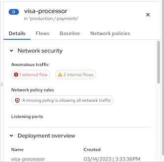
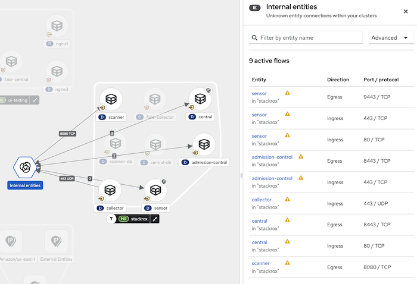

<!-- Format modified: converted from AsciiDoc to Markdown. See SOURCE.json for provenance. -->

A [Kubernetes network policy](https://kubernetes.io/docs/concepts/services-networking/network-policies/) is a specification of how groups of pods are allowed to communicate with each other and other network endpoints. These network policies are configured as YAML files. By looking at these files alone, it is often hard to identify whether the applied network policies achieve the desired network topology.

Red Hat Advanced Cluster Security for Kubernetes (RHACS) gathers all defined network policies from your orchestrator and provides tools to make these policies easier to use.

To support network policy enforcement, RHACS provides the following tools:

- Network graph

- Network policy generator

- Network policy simulator

- Build-time network policy generator

<a id="network-graph-20-docs"></a>

# Network graph

<a id="network-graph-20-view_manage-network-policies"></a>

## About the network graph

The network graph provides high-level and detailed information about deployments, network flows, and network policies in your environment.

RHACS processes all network policies in each secured cluster to show you which deployments can contact each other and which can reach external networks. It also monitors running deployments and tracks traffic between them. You can view the following items in the network graph:

Internal entities  
These represent a connection between a deployment and an IP address that belongs to the private address space as defined in [RFC 1918](https://datatracker.ietf.org/doc/html/rfc1918). For more information, see "Connections involving internal entities".

External entities  
These represent a connection between a deployment and an IP address that does not belong to the private address space as defined in [RFC 1918](https://datatracker.ietf.org/doc/html/rfc1918). For more information, see "External entities and connections in the network graph".

Network components  
From the top menu, you can select namespaces (indicated by the **NS** label) and deployments (indicated by the **D** label) to display on the graph for a chosen cluster (indicated by the **CL** label). You can further filter deployments by using the drop-down list and selecting criteria on which to filter, such as common vulnerabilities and exposures (CVEs), labels, and images.

Network flows  
You can select one of the following flows for the graph:

Active traffic  
Selecting this default option shows observed traffic, focused on the namespace or specific deployment that you selected. You can select the time period for which to display information.

Inactive flows  
Selecting this option shows potential flows allowed by your network policies, helping you identify missing network policies needed to achieve tighter isolation. You can select the time period for which to display information.

Network policies  
You can view existing policies for a selected component or view components that have no policies. You can also simulate network policies from the network graph view. See "Simulating network policies from the network graph" for more information.

<a id="navigation-user-interface_manage-network-policies"></a>

### Displays, navigation, and the user interface in the network graph

You can use the network graph, shown in the following graphic, to click on items and view additional information about them. You can also perform actions within the graph such as adding a network flow to your baseline.

<figure>

<figcaption>Network graph example</figcaption>
</figure>

The following tips can help you use the network graph:

- Opening the legend provides information about the symbols in use and their meaning. The legend shows explanatory text for symbols representing namespaces, deployments, and connections on the network graph.

- Selecting additional display options from the drop-down list controls whether the graph displays icons such as the network policy status badge, active external traffic badge, and port and protocol labels for edge connections.

- RHACS detects changes in network traffic, such as nodes joining or leaving. If changes are detected, the network graph displays a notification showing the number of updates available. To avoid interrupting your focus, the graph is not updated automatically. Click the notification to update the graph.

When you click an item in the graph, the rearranged side panel with collapsible sections presents information about that item. You can click on the following items:

- Deployments

- Namespaces

- External entities

- CIDR blocks

- External groups

The side panel displays relevant information based on the item in the graph that you have selected. The **D** or **NS** label next to the item name in the header (in this example, "visa-processor") indicates if it is a deployment or a namespace. The following example illustrates the side panel for a deployment.

<figure>

<figcaption>Side panel for a deployment example</figcaption>
</figure>

When viewing a namespace, the side panel includes a search bar and a list of deployments. You can click on a deployment to view its information. The side panel also includes a **Network policies** tab. From this tab, you can view, copy to the clipboard, or export any network policy defined in that namespace, as shown in the following example.

<figure>

<figcaption>Side panel for a namespace example</figcaption>
</figure>

<a id="external-entities-connections_manage-network-policies"></a>

### External entities and connections in the network graph

The network graph view shows network connections between managed clusters and external sources. In addition, RHACS automatically discovers and highlights public Classless Inter-Domain Routing (CIDR) address blocks, such as Google Cloud, AWS, Microsoft Azure, Oracle Cloud, and Cloudflare. Using this information, you can identify deployments with active external connections and decide if they are making or receiving unauthorized connections from outside your network.

By default, the external connections point to a common **External Entities** icon and different CIDR address blocks in the network graph. However, you can choose not to show auto-discovered CIDR blocks by clicking **Manage CIDR blocks** and deselecting **Auto-discovered CIDR blocks**.

RHACS includes IP ranges for the following cloud providers:

- Google Cloud

- AWS

- Microsoft Azure

- Oracle Cloud

- Cloudflare

RHACS fetches and updates the cloud providers' IP ranges every 7 days, and updates CIDR blocks daily. If you are using offline mode, you can update these ranges by installing new support packages.

The following image provides an example of the network graph. In this example, based on the options that the user has chosen, the graph depicts deployments in the selected namespace. Traffic flows are not displayed until you click on an item such as a deployment. The graph uses a red badge to indicate deployments that are missing policies and therefore allowing all network traffic.

<a id="internal-entities-connections_manage-network-policies"></a>

### Connections involving internal entities

The network graph is useful for identifying deployments with active connections to entities that do not belong to any known deployment or CIDR block. Some of these connections never reach outside of the cluster and are made within the cluster’s private network. The network graph represents those as connections to or from *internal entities*.

Connections with internal entities represent a connection between a deployment and an IP address that belongs to the private address space as defined in [RFC 1918](http://datatracker.ietf.org/doc/html/rfc1918). In some cases, Sensor is unable to identify one or both deployments involved in a connection. In that case, the system analyzes the IP address and decides whether the connection is internal or external.

The following scenarios can lead to a connection being categorized as one involving internal entities:

- A change of IP address or the deletion of a deployment accepting connections (the server) while the party initiating the connection (the client) still attempts to reach it

- A deployment communicating with the orchestrator API

- A deployment communicating using a networking CNI plugin, for example, Calico

- A restart of Sensor, resulting in a reset of the mapping of IP addresses to past deployments, for example, when Sensor does not recognize the IP addresses of past entities or past IP addresses of existing entities

- A connection that involves an entity not managed by the orchestrator (in some cases, that might be seen as *outside of the cluster*) but is using an IP address from the private address space as defined in RFC 1918

Internal entities are indicated with an icon as shown in the following graphic. Clicking on **Internal entities** shows the flows for these entities.

<figure>

<figcaption>Internal entities example</figcaption>
</figure>

<a id="rbac-for-network-graph_manage-network-policies"></a>

## Access control and permissions

To view network graphs, the user must have at least the permissions granted to the **Network Graph Viewer** default permission set.

The following permissions are granted to the **Network Graph Viewer** permission set:

- Read `Deployment`

- Read `NetworkGraph`

- Read `NetworkPolicy`

For more information, see "System permission sets" in the "Additional resources" section.

<div>

<div class="title">

Additional resources

</div>

- [System permission sets](manage-user-access/manage-role-based-access-control-3630.md#rbac-permission-sets_manage-role-based-access-control)

</div>

<a id="view-deployment-info_manage-network-policies"></a>

## Viewing deployment information

The network graph provides a visual map of deployments, namespaces, and connections that RHACS has discovered. By clicking on a deployment in the graph, you can view information about the deployment, including the following details:

- Network security, such as the number of flows, existing or missing network policy rules, and listening ports

- Labels and annotations

- Port configurations

- Container information

- Anomalous and baseline flows for ingress and egress connections, including protocols and port numbers

- Network policies

<div class="formalpara">

<div class="title">

Procedure

</div>

To view details for deployments in a namespace:

</div>

1.  In the RHACS portal, go to **Network Graph** and select your cluster from the drop-down list.

2.  Click the **Namespaces** list and use the search field to locate a namespace, or select individual namespaces.

3.  Click the **Deployments** list and use the search field to locate a deployment, or select individual deployments to display in the network graph.

4.  In the network graph, click on a deployment to view the information panel.

5.  Click the **Details**, **Flows**, **Baseline**, or **Network policies** tab to view the corresponding information.

<a id="view-network-policies-ng20_manage-network-policies"></a>

## Viewing network policies in the network graph

Network policies specify how groups of pods are allowed to communicate with each other and with other network endpoints. Kubernetes `NetworkPolicy` resources use labels to select pods and define rules that specify what traffic is allowed to or from the selected pods. RHACS discovers and displays network policy information for all your Kubernetes clusters, namespaces, deployments, and pods, in the network graph.

<div>

<div class="title">

Procedure

</div>

1.  In the RHACS portal, go to **Network Graph** and select your cluster from the drop-down list.

2.  Click the **Namespaces** list and select individual namespaces, or use the search field to locate a namespace.

3.  Click the **Deployments** list and select individual deployments, or use the search field to locate a deployment.

4.  In the network graph, click on a deployment to view the information panel.

5.  In the **Details** tab, in the **Network security** section, you can view summary messages about network policy rules that give the following information:

    - If policies exist in the network that regulate ingress or egress traffic

    - If your network is missing policies and is therefore allowing all ingress or egress traffic

6.  To view the YAML file for the network policies, you can click on the policy rule, or click the **Network policies** tab.

</div>

<a id="configure-cidr-blocks-ng20_manage-network-policies"></a>

## Configuring CIDR blocks in the network graph

You can specify custom CIDR blocks or configure the display of auto-discovered CIDR blocks in the network graph.

<div>

<div class="title">

Procedure

</div>

1.  In the RHACS portal, go to **Network Graph**, and then select **Manage CIDR Blocks**. You can perform the following actions:

    - Toggle **Auto-discovered CIDR blocks** to hide auto-discovered CIDR blocks in the network graph.

      > [!NOTE]
      > When you hide the auto-discovered CIDR blocks, the auto-discovered CIDR blocks are hidden for all clusters, and not only for the selected cluster in the network graph.

    - Add a custom CIDR block to the graph by performing the following steps:

      1.  Enter the CIDR name and CIDR address in the fields. To add additional CIDR blocks, click **Add CIDR block** and enter information for each block.

      2.  Click **Update Configuration** to save the changes.

</div>

<a id="network-graph-simulate-generate"></a>

# Using the network graph to generate and simulate network policies

<a id="policy-generation-strategy-ng20_manage-network-policies"></a>

## About generating policies from the network graph

A Kubernetes network policy controls which pods receive incoming network traffic, and which pods can send outgoing traffic. By using network policies to enable and disable traffic to or from pods, you can limit your network attack surface.

These network policies are YAML configuration files. It is often difficult to gain insights into the network flow and manually create these files. You can use RHACS to generate these files. When you automatically generate network policies, RHACS follows these guidelines:

- RHACS generates a single network policy for each deployment in the namespace. The pod selector for the policy is the pod selector of the deployment.

  - If a deployment already has a network policy, RHACS does not generate new policies or delete existing policies.

    Generated policies only restrict traffic to existing deployments.

  - Deployments that you create later will not have any restrictions unless you create or generate new network policies for them.

  - If a new deployment needs to contact a deployment with a network policy, you might need to edit the network policy to allow access.

- Each policy has the same name as the deployment name, prefixed with `stackrox-generated-`. For example, the policy name for the deployment `depABC` in the generated network policy is `stackrox-generated-depABC`. All generated policies also have an identifying label.

- RHACS generates a single rule allowing traffic from any IP address if one of the following conditions are met:

  - The deployment has an incoming connection from outside the cluster within the selected time

  - The deployment is exposed through a node port or load balancer service

- RHACS generates one `ingress` rule for every deployment from which there is an incoming connection.

  - For deployments in the same namespace, this rule uses the pod selector labels from the other deployment.

  - For deployments in different namespaces, this rule uses a namespace selector. To make this possible, RHACS automatically adds a label, `namespace.metadata.stackrox.io/name`, to each namespace.

> [!IMPORTANT]
> In rare cases, if a standalone pod does not have any labels, the generated policy allows traffic from or to the pod’s entire namespace.

<a id="generate-network-policies-ng20_manage-network-policies"></a>

## Generating network policies in the network graph

RHACS lets you automatically generate network policies based on the actual observed network communication flows in your environment.

You can generate policies based on the cluster, namespaces, and deployments that you have selected in the network graph. Policies are generated for any deployments that are included in the current Network Graph scope. For example, the current scope could include the entire cluster, a cluster and namespaces, or individually selected deployments in the selected namespaces. You can also further reduce the scope by applying one of the filters from the **Filter deployments** field with any combination of the cluster, namespace, and deployment selections. For example, you could narrow the scope to deployments in a specific cluster and namespace that are affected by a specific CVE. Policies are generated from the traffic observed during the baseline discovery period.

1.  In the RHACS portal, go to **Network Graph**.

2.  Select a cluster, and then select one or more namespaces.

3.  Optional: Select individual deployments to restrict the policy generated to only those deployments. You can also use the **Filter deployments** feature to further narrow the scope.

4.  In the network graph header, select **Network policy generator**.

5.  Optional: In the information panel that opens, select **Exclude ports & protocols** to remove the port/protocol restrictions when generating network policies from a baseline.

    As an example, the `nginx3` deployment makes a port 80 connection to `nginx4`, and this is included as part of the baseline for `nginx4`. If policies are generated and this checkbox is not selected (the default behavior), the generated policy will restrict the allowed connections from `nginx3` to `nginx4` to only port 80. If policies are generated with this option selected, the generated policy will allow any port in the connection from `nginx3` to `nginx4`.

6.  Click **Generate and simulate network policies**. RHACS generates policies for the scope that you have chosen. This scope is displayed at the top of the **Generate network policies** panel.

    > [!NOTE]
    > Clicking on the deployment information in the scope displays a list of the deployments that are included.

7.  Optional: Copy the generated network policy configuration YAML file to the clipboard or download it by clicking the download icon in the panel.

8.  Optional: To compare the generated network policies to the existing network policies, click **Compare**. The YAML files for existing and generated network policies are shown in a side-by-side view.

    > [!NOTE]
    > Some items do not have generated policies, such as namespaces with existing ingress policies or deployments in certain protected namespaces such as as `stackrox` or `acs`.

9.  Optional: Click the **Actions** menu to perform the following activities:

    - Share the YAML file with notifiers: Sends the YAML file to one of the system notifiers you have configured, for example, Slack, ServiceNow, or an application that uses generic webhooks. These notifiers are configured by navigating to **Platform Configuration** → **Integrations**. See the documentation in the "Additional resources" section for more information.

    - Rebuild rules from active traffic: Refreshes the generated policies that are displayed.

    - Revert rules to previously applied YAML: Removes the simulated policy and reverts to the last network policy.

<a id="save-generated-policies-ng20_manage-network-policies"></a>

## Saving generated policies in the network graph

You can download and save the generated network policies from RHACS. Use this option to download policies so that you can commit the policies into a version control system such as Git.

<div>

<div class="title">

Procedure

</div>

- After generating a network policy, click the **Download YAML** icon in the **Network Policy Simulator** panel.

</div>

<a id="test-generated-policies-ng20_manage-network-policies"></a>

## Testing generated policies in the network graph

After you download the network policies that RHACS generates, you can test them by applying them to your cluster by using the CLI or your automated deployment procedures. You cannot apply generated network policies directly in the network graph.

> [!NOTE]
> If you use Kubernetes, enter `kubectl` instead of `oc`.

<div>

<div class="title">

Procedure

</div>

1.  To create policies using the saved YAML file, run the following command:

    ``` terminal
    $ oc create -f "<generated_file>.yml"
    ```

2.  If the generated policies cause problems, you can remove them by running the following command:

    ``` terminal
    $ oc delete -f "<generated_file>.yml"
    ```

    > [!WARNING]
    > Directly applying network policies might cause problems for running applications. Always download and test the network policies in a development environment or test clusters before applying them to production workloads.

</div>

<a id="delete-generated-policies-ng20_manage-network-policies"></a>

## Reverting to a previously applied policy in the network graph

You can remove a policy and revert to a previously applied policy.

<div>

<div class="title">

Procedure

</div>

1.  In the RHACS portal, go to **Network Graph**.

2.  Select a cluster name from the menu on the top bar.

3.  Select one or more namespaces and deployments.

4.  Select **Simulate network policy**.

5.  Select **View active YAMLS**.

6.  From the **Actions** menu, select **Revert rules to previously applied YAML**.

    > [!WARNING]
    > Directly applying network policies might cause problems for running applications. Always download and test the network policies in a development environment or test clusters before applying them to production workloads.

</div>

<a id="delete-all-autogenerated-policies-ng20_manage-network-policies"></a>

## Deleting all policies autogenerated in the network graph

You can delete all automatically generated policies from your cluster that you have created by using RHACS.

> [!NOTE]
> If you use Kubernetes, enter `kubectl` instead of `oc`.

<div>

<div class="title">

Procedure

</div>

- Run the following command:

  ``` terminal
  $ oc get ns -o jsonpath='{.items[*].metadata.name}' | \
  xargs -n 1 oc delete networkpolicies -l \
  'network-policy-generator.stackrox.io/generated=true' -n
  ```

</div>

<a id="simulate-network-policies-ng20_manage-network-policies"></a>

## Simulating network policies from the network graph

Your current network policies might allow unneeded network communications. You can use the network policy generator to create network policies that restrict ingress traffic to the computed baselines for a set of deployments.

> [!NOTE]
> The Network Graph does not display the generated policies in the visualization. Generated policies are only for ingress traffic and policies that restrict egress traffic are not generated.

<div>

<div class="title">

Procedure

</div>

1.  In the RHACS portal, go to **Network Graph**.

2.  Select a cluster, and then select one or more namespaces.

3.  On the network graph header, select **Network policy generator**.

4.  You can perform the following actions:

    - Generate a YAML file with network policies to use in the simulation by clicking **Generate and simulate network policies**. For more information, see "Generating network policies in the network graph".

    - Upload a YAML file of a network policy that you want to use in the simulation by performing the following steps:

      1.  Click **Upload YAML** and then select the file.

      2.  Click **Open**. The system displays a message to indicate the processing status of the uploaded policy.

5.  You can view active YAML files that correspond to the current network policies by clicking the **View active YAMLS** tab, and then selecting policies from the drop-down list. You can also perform the following actions:

    - Click the appropriate button to copy or download the displayed YAML file.

    - Use the **Actions** menu to rebuild rules from active traffic or revert rules to a previously applied YAML. For more information, see "Generating network policies in the network graph".

</div>

<div>

<div class="title">

Additional resources

</div>

- [Updating kernel support packages in offline mode](../configuration/enable-offline-mode.md#update-kernel-support-packages_enable-offline-mode)

- [Integrating using generic webhooks](../integration/integrate-using-generic-webhooks.md)

</div>

<a id="use-network-baselining-ng20_manage-network-policies"></a>

# About network baselining in the network graph

In RHACS, you can minimize your risks by using network baselining. It is a proactive approach to keep your infrastructure secure. RHACS first discovers existing network flows and creates a baseline, and then it treats network flows outside of this baseline as anomalous.

When you install RHACS, there is no default network baseline. As RHACS discovers network flows, it creates a baseline and then it adds all discovered network flows to it, following these guidelines:

- When RHACS discovers new network activity, it adds that network flow to the network baseline.

- Network flows do not show up as anomalous flows and do not trigger any violations.

After the discovery phase, the following actions occur:

- RHACS stops adding network flows to the network baselines.

- New network flows that are not in the network baseline show up as anomalous flows but they do not trigger any violations.

<a id="view-network-baselines-ng20_manage-network-policies"></a>

## Viewing network baselines from the network graph

You can view network baselines from the network graph view.

<div>

<div class="title">

Procedure

</div>

1.  Click the **Namespaces** list and use the search field to locate a namespace, or select individual namespaces.

2.  Click the **Deployments** list and use the search field to locate a deployment, or select individual deployments to display in the network graph.

3.  In the network graph, click on a deployment to view the information panel.

4.  Select the **Baseline** tab. Use the **filter by entity name** field to further restrict the flows that are displayed.

5.  Optional: You can mark baseline flows as anomalous by performing one of the following actions:

    - Select an individual entity. Click the overflow menu, , and then select **Mark as anomalous**.

    - Select multiple entities, and then click **Bulk actions** and select **Mark as anomalous**.

6.  Optional: Check the box to exclude ports and protocols.

7.  Optional: To save the baseline as a network policy YAML file, click **Download baseline as network policy**.

</div>

<a id="download-network-baselines_manage-network-policies"></a>

## Downloading network baselines from the network graph

You can download network baselines as YAML files from the network graph view.

<div>

<div class="title">

Procedure

</div>

1.  In the RHACS portal, go to **Network Graph**.

2.  Click the **Namespaces** list and use the search field to locate a namespace, or select individual namespaces.

3.  Click the **Deployments** list and use the search field to locate a deployment, or select individual deployments to display in the network graph.

4.  In the network graph, click on a deployment to view the information panel.

5.  The **Baseline** tab lists the baseline flows. Use the **filter by entity name** field to further restrict the list of flows.

6.  Optional: Check the box to exclude ports and protocols.

7.  Click **Download baseline as network policy**.

</div>

<a id="configuring-network-baselining-timeframe_manage-network-policies"></a>

## Configuring the network baseline observation time frame

You can configure the duration of the observation period that RHACS uses when creating the network baseline.

<div>

<div class="title">

Procedure

</div>

- Set the `ROX_NETWORK_BASELINE_OBSERVATION_PERIOD` environment variable by running the following command:

  ``` terminal
  $ oc -n stackrox set env deploy/central \
    ROX_NETWORK_BASELINE_OBSERVATION_PERIOD=<value>
  ```

  - `oc`: If you use Kubernetes, enter `kubectl`.

  - `<value>`: Use time units, for example: `300ms`, `-1.5h`, or `2h45m`. Valid time units are:

    - `ns`

    - `us` or `µs`

    - `ms`

    - `s`

    - `m`

    - `h`

</div>

<a id="enable-alert-on-baseline-violations-ng20_manage-network-policies"></a>

## Enabling alerts on baseline violations in the network graph

You can configure RHACS to detect anomalous network flows and trigger violations for traffic that is not in the baseline. This can help you determine if the network contains unwanted traffic before you block traffic with a network policy.

<div>

<div class="title">

Procedure

</div>

1.  Click the **Namespaces** list and use the search field to locate a namespace, or select individual namespaces.

2.  Click the **Deployments** list and use the search field to locate a deployment, or select individual deployments to display in the network graph.

3.  In the network graph, click on a deployment to view the information panel.

4.  In the **Baseline** tab, you can view baseline flows. Use the **filter by entity name** field to further restrict the flows that are displayed.

5.  Toggle the **Alert on baseline violations** option.

    - After you toggle the **Alert on baseline violations** option, anomalous network flows trigger violations.

    - You can toggle the **Alert on baseline violations** option again to stop receiving violations for anomalous network flows.

</div>
