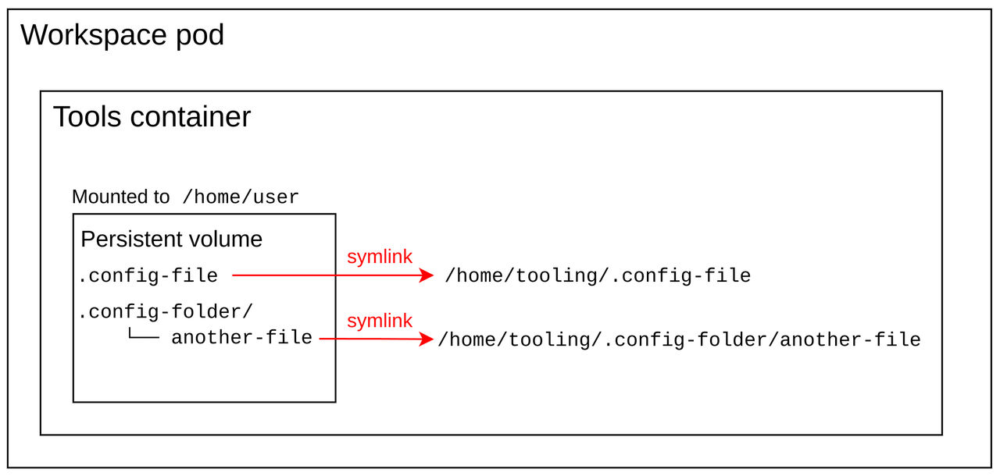

> Source: [Red Hat OpenShift Dev Spaces 3.29](https://docs.redhat.com/en/documentation/red_hat_openshift_dev_spaces/3.29/configure-con_persistent_user_home). Copyright Red Hat.
> Adapted from HTML to Markdown for offline use; see [legal notice](LEGAL-NOTICE.md) and [CC BY-SA 3.0](LICENSE.md). Links adjusted; source-fragment gaps are recorded in SOURCE.json.

<span id="ariaid-title1"></span>

# How workspace files persist across restarts

Red Hat OpenShift Dev Spaces preserves the `/home/user` directory across workspace restarts for each non-ephemeral workspace, so that user-specific configurations, shell history, and tooling settings persist between sessions.

This page is for platform administrators who manage the persistent home feature, and for developers who build custom workspace images that must meet specific directory layout requirements.

This feature is enabled by default. To disable it, set `spec.devEnvironments.persistUserHome.enabled` to `false` in the CheCluster custom resource.

For newly started workspaces, this feature creates a persistent volume claim (PVC) mounted to the `/home/user` path of the tools container. The tools container is the first container defined in the devfile. This is the container that includes the project source code by default.

When the PVC is mounted for the first time, the persistent volume’s contents are empty and therefore must be populated with the `/home/user` directory content.

By default, the `persistUserHome` feature creates an init container for each new workspace pod named `init-persistent-home`. This init container is created with the tools container image. It runs a `stow` command to create symbolic links in the persistent volume, populating the `/home/user` directory.

Note

For files that cannot be symbolically linked to the `/home/user` directory, such as `.viminfo` and `.bashrc`, `cp` is used instead of `stow`.

The primary function of the `stow` command is to run:

``` bash
stow -t /home/user/ -d /home/tooling/ --no-folding
```

The `stow` command creates symbolic links in `/home/user` for files and directories located in `/home/tooling`. This populates the persistent volume with symbolic links to the content in `/home/tooling`. As a result, the `persistUserHome` feature expects the tooling image to have its `/home/user/` content within `/home/tooling`.

For example, if the tools container image contains `.config` and `.config-folder/another-file` in the `/home/tooling` directory, `stow` creates symbolic links as follows:

<figure>
<br />
<br />

<figcaption>Figure 1. Tools container with <code>persistUserHome</code> enabled</figcaption>
</figure>

The init container writes the output of the `stow` command to `/home/user/.stow.log` and only runs `stow` the first time the persistent volume is mounted to the workspace.

Using the `stow` command to populate `/home/user` content in the persistent volume provides two main advantages:

1.  Creating symbolic links is faster and consumes less storage than creating copies of the `/home/user` directory content in the persistent volume. The persistent volume contains symbolic links, not the actual files.
2.  If the tools image is updated with newer versions of existing binaries, configs, and files, the init container does not need to rerun `stow`. The existing symbolic links already point to the newer versions in `/home/tooling`.

Note

If the tooling image is updated with additional binaries or files, they are not symbolically linked to the `/home/user` directory. The `stow` command does not run again automatically.

To rerun `stow`, delete the `/home/user/.stow_completed` file and restart the workspace.

<span id="con_persistent-user-home_devspaces___persistuserhome_tools_image_requirements"></span>

## [persistUserHome tools image requirements](configure-con_persistent_user_home.md#con_persistent-user-home_devspaces___persistuserhome_tools_image_requirements)

The `persistUserHome` depends on the tools image used for the workspace. By default OpenShift Dev Spaces uses the Universal Developer Image (UDI) for sample workspaces, which supports `persistUserHome` out of the box.

If you are using a custom image, the tools image must meet three requirements to support the `persistUserHome` feature.

- The tools image must contain `stow` version \>= 2.4.0.
- The `$HOME` environment variable is set to `/home/user`.
- The directory intended to contain the `/home/user` content is `/home/tooling`.

Because the `/home/user` content must reside in `/home/tooling`, the default UDI image adds the `/home/user` content to `/home/tooling` instead, and runs:

``` plaintext
RUN stow -t /home/user/ -d /home/tooling/ --no-folding
```

This `RUN` instruction in the Dockerfile ensures that files in `/home/tooling` are accessible from `/home/user` even when the `persistUserHome` feature is not enabled.
