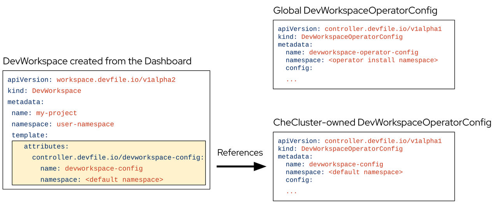

> Source: [Red Hat OpenShift Dev Spaces 3.29](https://docs.redhat.com/en/documentation/red_hat_openshift_dev_spaces/3.29/configure-ref_devworkspace_operator_custom_resources). Copyright Red Hat.
> Adapted from HTML to Markdown for offline use; see [legal notice](LEGAL-NOTICE.md) and [CC BY-SA 3.0](LICENSE.md). Links adjusted; source-fragment gaps are recorded in SOURCE.json.

<span id="ariaid-title1"></span>

# Dev Workspace Operator custom resources

Configure the Dev Workspace Operator through its custom resources to control workspace behavior, endpoint routing, and operator deployment settings.

<span id="ref_devworkspace-operator-custom-resources_devspaces___what_a_workspace_object_contains"></span>

## [What a workspace object contains](configure-ref_devworkspace_operator_custom_resources.md#ref_devworkspace-operator-custom-resources_devspaces___what_a_workspace_object_contains)

The `Dev Workspace` custom resource contains details about an OpenShift Dev Spaces workspace. Notably, it contains devfile details and a reference to the editor definition.

<span id="ref_devworkspace-operator-custom-resources_devspaces___what_a_workspace_template_defines"></span>

## [What a workspace template defines](configure-ref_devworkspace_operator_custom_resources.md#ref_devworkspace-operator-custom-resources_devspaces___what_a_workspace_template_defines)

In OpenShift Dev Spaces the `DevWorkspaceTemplate` custom resource is typically used to define an editor (such as Visual Studio Code - Open Source) for OpenShift Dev Spaces workspaces. You can use this custom resource to define reusable `spec.template` content that is reused by multiple Dev Workspaces.

<span id="ref_devworkspace-operator-custom-resources_devspaces___how_operator_configuration_works"></span>

## [How operator configuration works](configure-ref_devworkspace_operator_custom_resources.md#ref_devworkspace-operator-custom-resources_devspaces___how_operator_configuration_works)

The `DevWorkspaceOperatorConfig` (DWOC) custom resource defines configuration options for the DWO. There are two different types of DWOC:

- global configuration
- non-global configuration

The global configuration is a DWOC custom resource named `devworkspace-operator-config` and is usually located in the DWO installation namespace. By default, the global configuration is not created upon installation. Configuration fields set in the global configuration apply to the DWO and all Dev Workspaces. However, the DWOC configuration can be overridden by a non-global configuration.

Any other DWOC custom resource than `devworkspace-operator-config` is considered to be non-global configuration. A non-global configuration does not apply to any Dev Workspaces unless the Dev Workspace contains a reference to the DWOC. If the global configuration and non-global configuration have the same fields, the non-global configuration field takes precedence.

<span id="ref_devworkspace-operator-custom-resources_devspaces___how_operator_configuration_works__entry__1"></span><span id="ref_devworkspace-operator-custom-resources_devspaces___how_operator_configuration_works__entry__2"></span><span id="ref_devworkspace-operator-custom-resources_devspaces___how_operator_configuration_works__entry__3"></span>

|  | Global DWOC | OpenShift Dev Spaces-owned DWOC |
|----|----|----|
| Resource name | `devworkspace-operator-config` | `devworkspace-config` |
| Namespace | DWO installation namespace | OpenShift Dev Spaces installation namespace |
| Default creation | Not created by default upon DWO installation | Created by default on OpenShift Dev Spaces installation |
| Scope | Applies to the DWO itself and all Dev Workspaces managed by DWO | Applies to Dev Workspaces created by OpenShift Dev Spaces |
| Precedence | Overridden by fields set in OpenShift Dev Spaces-owned config | Takes precedence over global config if both define the same field |
| Primary use case | Used to define default, broad settings that apply to DWO in general. | Used to define specific configuration for Dev Workspaces created by OpenShift Dev Spaces |

Table 1. Global DWOC and OpenShift Dev Spaces-owned DWOC comparison

For example, by default OpenShift Dev Spaces creates and manages a non-global DWOC in the OpenShift Dev Spaces namespace named `devworkspace-config`. This DWOC contains configuration specific to OpenShift Dev Spaces workspaces, and is maintained by OpenShift Dev Spaces depending on how you configure the CheCluster CR. When OpenShift Dev Spaces creates a workspace, OpenShift Dev Spaces adds a reference to the OpenShift Dev Spaces-owned DWOC with the `controller.devfile.io/devworkspace-config` attribute.

<figure>
<br />
<br />

<figcaption>Figure 1. Example of Dev Workspace configuration attribute</figcaption>
</figure>

<span id="ref_devworkspace-operator-custom-resources_devspaces___how_workspace_endpoints_are_routed"></span>

## [How workspace endpoints are routed](configure-ref_devworkspace_operator_custom_resources.md#ref_devworkspace-operator-custom-resources_devspaces___how_workspace_endpoints_are_routed)

The `DevWorkspaceRouting` custom resource defines details about the endpoints of a Dev Workspace. Every Dev Workspace has its corresponding `DevWorkspaceRouting` object that specifies the workspace’s container endpoints. Endpoints defined from the devfile, as well as endpoints defined by the editor definition appear in the `DevWorkspaceRouting` custom resource.

``` yaml
apiVersion: controller.devfile.io/v1alpha1
kind: DevWorkspaceRouting
metadata:
  annotations:
    controller.devfile.io/devworkspace-started: 'false'
  name: routing-workspaceb14aa33254674065
  labels:
    controller.devfile.io/devworkspace_id: workspaceb14aa33254674065
spec:
  devworkspaceId: workspaceb14aa33254674065
  endpoints:
    universal-developer-image:
      - attributes:
          cookiesAuthEnabled: true
          discoverable: false
          type: main
          urlRewriteSupported: true
        exposure: public
        name: che-code
        protocol: https
        secure: true
        targetPort: 3100
  podSelector:
    controller.devfile.io/devworkspace_id: workspaceb14aa33254674065
  routingClass: che
status:
  exposedEndpoints:
    ...
```

<span id="ref_devworkspace-operator-custom-resources_devspaces___what_pods_the_operator_runs"></span>

## [What pods the operator runs](configure-ref_devworkspace_operator_custom_resources.md#ref_devworkspace-operator-custom-resources_devspaces___what_pods_the_operator_runs)

The Dev Workspace Operator has two operands:

- controller deployment
- webhook deployment.

``` bash
$ oc get pods -l 'app.kubernetes.io/part-of=devworkspace-operator' -o custom-columns=NAME:.metadata.name -n openshift-operators
NAME
devworkspace-controller-manager-66c6f674f5-l7rhj
devworkspace-webhook-server-d4958d9cd-gh7vr
devworkspace-webhook-server-d4958d9cd-rfvj6
```

where:

`devworkspace-controller-manager-*`  
The Dev Workspace controller pod, which is responsible for reconciling custom resources.

`devworkspace-webhook-server-*`  
The Dev Workspace operator webhook server pods.

<span id="ref_devworkspace-operator-custom-resources_devspaces___adjust_the_controller_manager_resources"></span>

## [Adjust the controller-manager resources](configure-ref_devworkspace_operator_custom_resources.md#ref_devworkspace-operator-custom-resources_devspaces___adjust_the_controller_manager_resources)

You can configure the `devworkspace-controller-manager` pod in the Dev Workspace Operator Subscription object:

``` yaml
apiVersion: operators.coreos.com/v1alpha1
kind: Subscription
metadata:
  name: devworkspace-operator
  namespace: openshift-operators
spec:
  config:
    affinity:
      nodeAffinity: ...
      podAffinity: ...
    resources:
      limits:
        memory: ...
        cpu: ...
      requests:
        memory: ...
        cpu: ...
```

<span id="ref_devworkspace-operator-custom-resources_devspaces___scale_and_schedule_the_webhook_server"></span>

## [Scale and schedule the webhook server](configure-ref_devworkspace_operator_custom_resources.md#ref_devworkspace-operator-custom-resources_devspaces___scale_and_schedule_the_webhook_server)

You can configure the `devworkspace-webhook-server` deployment in the global DWOC:

``` yaml
apiVersion: controller.devfile.io/v1alpha1
kind: DevWorkspaceOperatorConfig
metadata:
  name: devworkspace-operator-config
  namespace: <DWO install namespace>
config:
  webhooks:
    nodeSelector: <map[string]string>
    replicas: <int>
    tolerations: <[]corev1.Toleration>
```

**Related information**  

- [Operator Lifecycle Manager Subscription configuration](https://github.com/operator-framework/operator-lifecycle-manager/blob/master/doc/design/subscription-config.md)
- [Dev Workspace Operator repository](https://github.com/devfile/devworkspace-operator)
