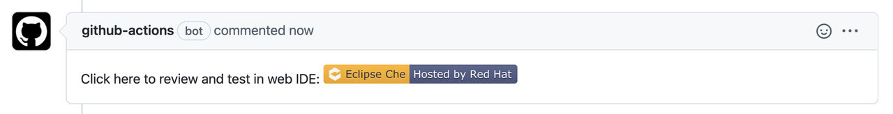
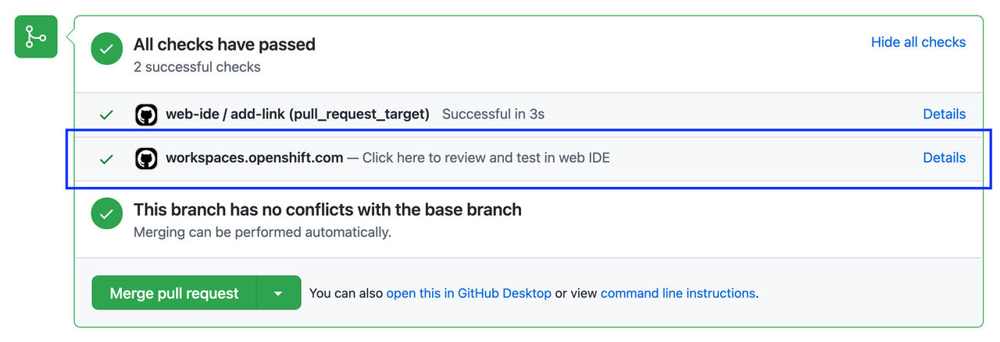

> Source: [Red Hat OpenShift Dev Spaces 3.29](https://docs.redhat.com/en/documentation/red_hat_openshift_dev_spaces/3.29/develop-con_try_in_web_ide_github_action). Copyright Red Hat.
> Adapted from HTML to Markdown for offline use; see [legal notice](LEGAL-NOTICE.md) and [CC BY-SA 3.0](LICENSE.md). Links adjusted; source-fragment gaps are recorded in SOURCE.json.

# Try in Web IDE GitHub action

The Try in Web IDE GitHub action adds a factory URL to pull requests, enabling reviewers to quickly test changes in a Red Hat OpenShift Dev Spaces workspace.

Note

The Che documentation repository is a real-life example where the Try in Web IDE GitHub action helps reviewers quickly test pull requests. Experience the workflow by navigating to a recent pull request and opening a factory URL.

<figure>
 
 

<figcaption>Figure 1. Pull request comment created by the Try in Web IDE GitHub action. Clicking the badge opens a new workspace for reviewers to test the pull request.</figcaption>
</figure>

<figure>
 
 

<figcaption>Figure 2. Pull request status check created by the Try in Web IDE GitHub action. Clicking the "Details" link opens a new workspace for reviewers to test the pull request.</figcaption>
</figure>

Providing a devfile in the root directory of the repository is recommended to define the development environment of the workspace created by the factory URL. In this way, the workspace contains everything users need to review pull requests, such as plugins, development commands, and other environment setup.

The Che documentation repository devfile is an example of a well-defined and effective devfile. For the repository and its devfile, see Additional resources.

**Related tasks**  

- [Add the action to a GitHub repository workflow](develop-proc_adding_try_in_web_ide_github_action.md "Add the Try in Web IDE GitHub action to a GitHub repository workflow so that contributors can quickly open pull requests in a ready-to-use cloud workspace.")

**Related information**  

- [Try in Web IDE GitHub action](https://github.com/marketplace/actions/try-in-web-ide)
- [Che documentation repository](https://github.com/eclipse/che-docs)
- [Che documentation repository devfile](https://github.com/eclipse/che-docs/blob/main/devfile.yaml)
- [Devfile.io](https://devfile.io/)
