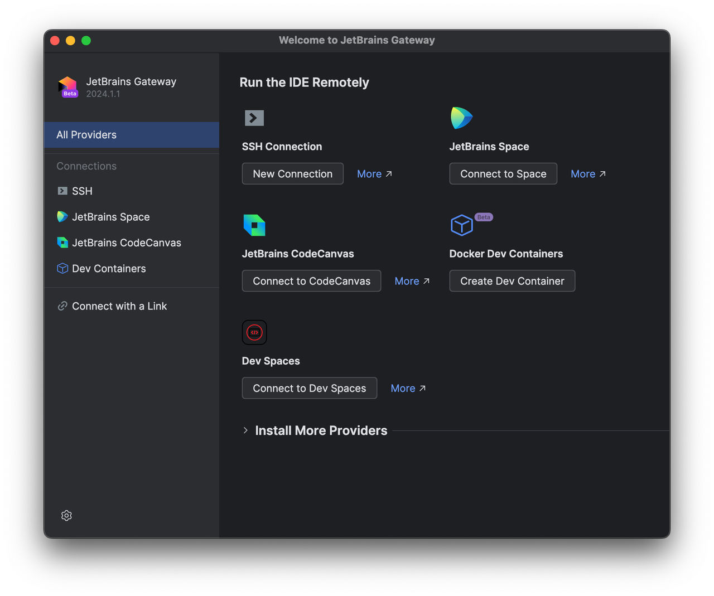
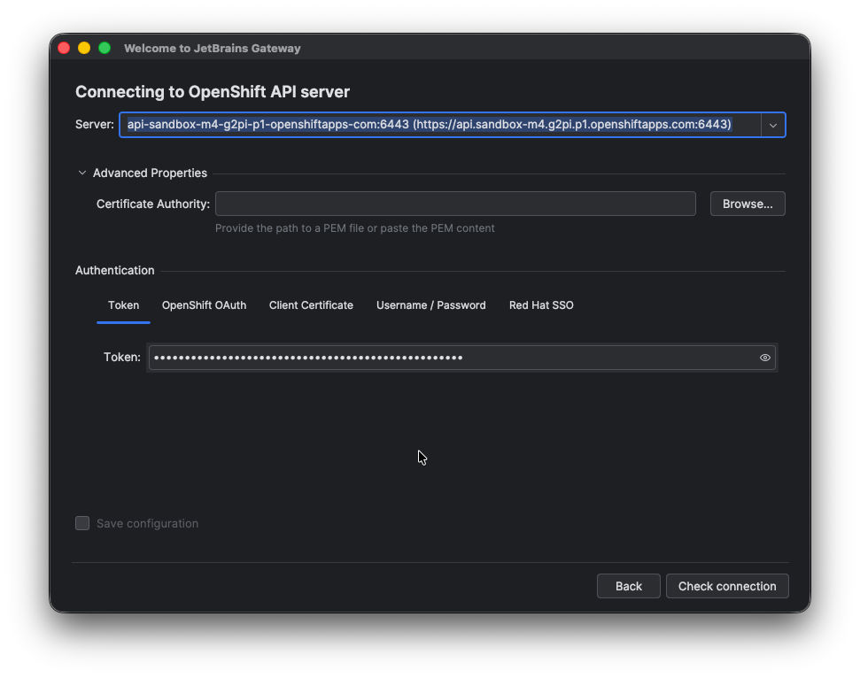
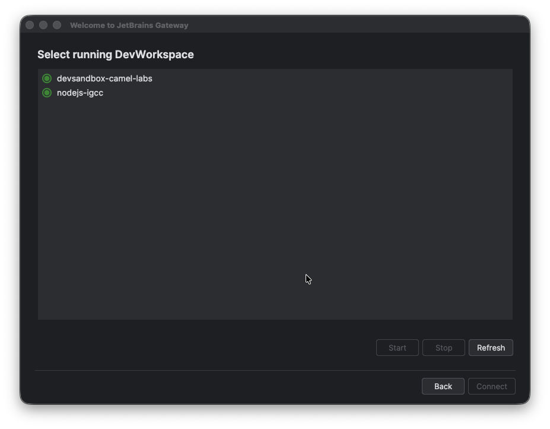
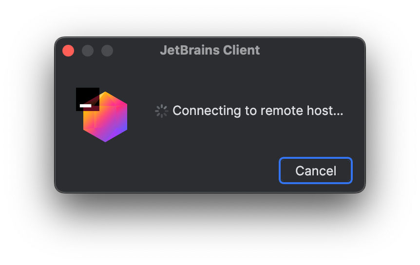

> Source: [Red Hat OpenShift Dev Spaces 3.29](https://docs.redhat.com/en/documentation/red_hat_openshift_dev_spaces/3.29/develop-proc_connecting_jetbrains_intellij_to_existing_workspace). Copyright Red Hat.
> Adapted from HTML to Markdown for offline use; see [legal notice](LEGAL-NOTICE.md) and [CC BY-SA 3.0](LICENSE.md). Links adjusted; source-fragment gaps are recorded in SOURCE.json.

# Connect JetBrains IntelliJ IDEA Ultimate Edition to an existing Dev Spaces workspace

Connect your local IntelliJ IDEA Ultimate Edition IDE to an existing OpenShift Dev Spaces workspace by using the JetBrains Gateway application, without accessing the OpenShift Dev Spaces Dashboard.

## Before you begin

- You have [the JetBrains Gateway application](https://www.jetbrains.com/remote-development/gateway/) installed.
- You have [the Gateway provider for OpenShift Dev Spaces](https://plugins.jetbrains.com/plugin/24234-openshift-dev-spaces) installed.
- You are logged in to your OpenShift server with `oc`. The `oc login` command saves the connection information to the configuration file, which is read by the Gateway provider for OpenShift Dev Spaces.
- You have sufficient Persistent Volume Claim (PVC) size to download and unpack the JetBrains IDE. CLion IDE, which is the largest of the IDEs, requires approximately 8.5 GB of disk space. Also consider the recommendations for calculating [memory and CPU](plan-proc_calculating_resource_requirements.md).
- You have a running OpenShift Dev Spaces workspace.

## About this task

Important

Integration with the [JetBrains Gateway](https://www.jetbrains.com/remote-development/gateway/) is currently implemented only for x86 OpenShift clusters.

## Procedure

1.  Open the Gateway app and click `Connect to Dev Spaces`:  
      
2.  Provide or select the OpenShift Application Programming Interface (API) server URL, choose an authentication method, then provide the required authentication details and click the `Check connection` button to continue:  
      
3.  Choose your workspace, ensure that it is running, then click the `Connect` button:  
      

## Results

- Your local Gateway application is running the JetBrains Client and connects to the workspace:  
    

**Related concepts**  

- [What you can customize in a Cloud Development Environment](develop-con_customizing_workspace_components.md "OpenShift Dev Spaces provides several options to customize your workspaces to match project requirements and team standards.")
- [IDEs in Cloud Development Environments](develop-con_ides_in_workspaces.md "OpenShift Dev Spaces supports multiple Integrated Development Environments (IDEs) that can be used in workspaces. The default IDE is Microsoft Visual Studio Code - Open Source.")

**Related tasks**  

- [Connect JetBrains IntelliJ IDEA Ultimate Edition to a new Dev Spaces workspace](develop-proc_connecting_jetbrains_intellij_to_devspaces.md "Connect your local IntelliJ IDEA Ultimate Edition IDE to a new OpenShift Dev Spaces workspace over JetBrains Gateway.")
- [Connect JetBrains Toolbox to an OpenShift Dev Spaces workspace](develop-proc_connecting_jetbrains_toolbox_to_devspaces.md "Connect your local JetBrains IDE to a running OpenShift Dev Spaces workspace by using the JetBrains Toolbox application.")
