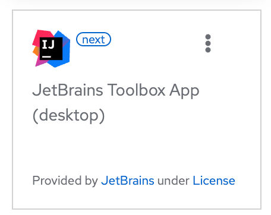
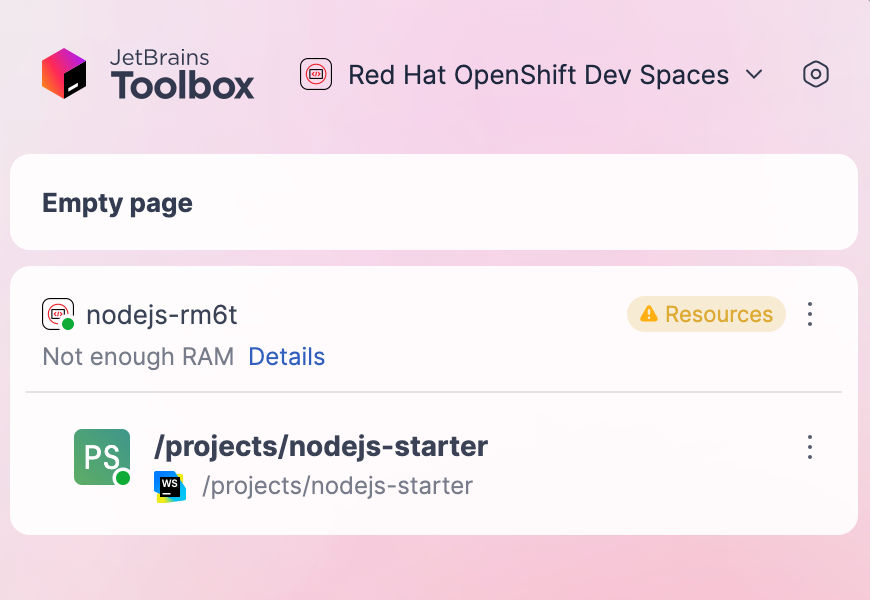
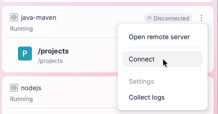
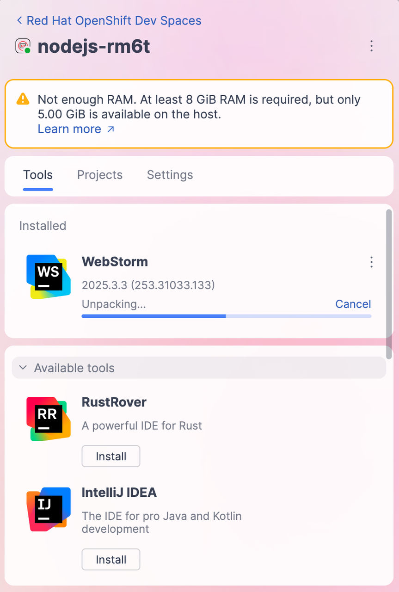
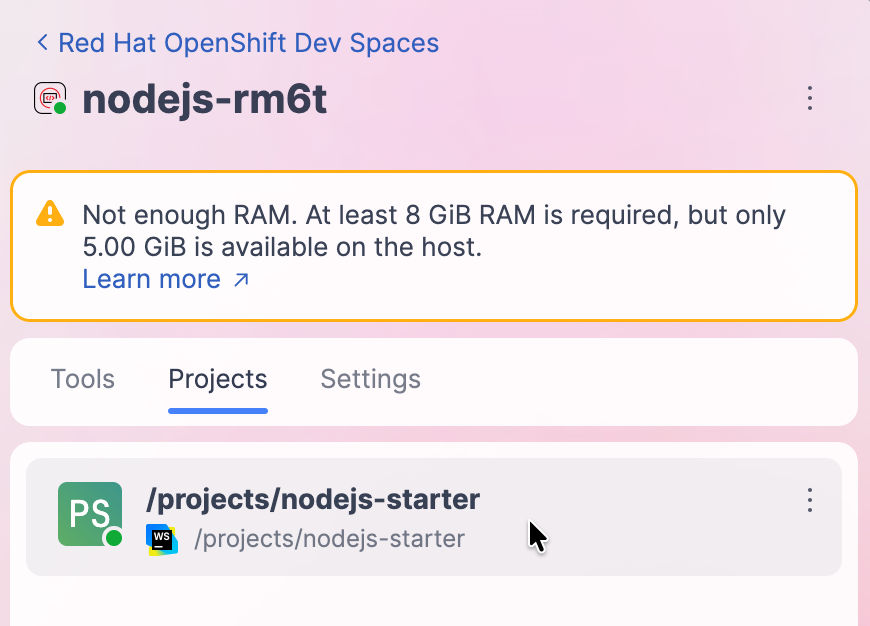
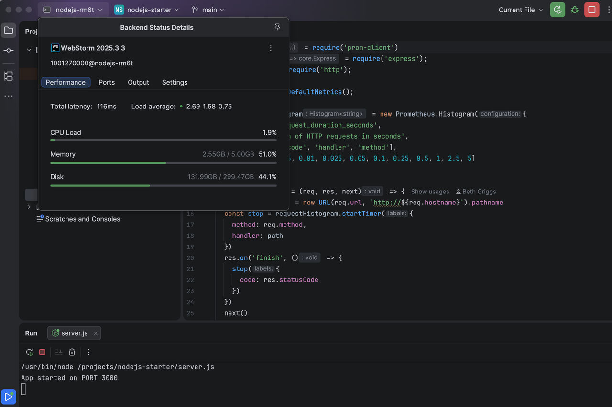

> Source: [Red Hat OpenShift Dev Spaces 3.29](https://docs.redhat.com/en/documentation/red_hat_openshift_dev_spaces/3.29/develop-proc_connecting_jetbrains_toolbox_to_devspaces). Copyright Red Hat.
> Adapted from HTML to Markdown for offline use; see [legal notice](LEGAL-NOTICE.md) and [CC BY-SA 3.0](LICENSE.md). Links adjusted; source-fragment gaps are recorded in SOURCE.json.

<span id="ariaid-title1"></span>

# Connect JetBrains Toolbox to an OpenShift Dev Spaces workspace

Connect your local JetBrains IDE to a running OpenShift Dev Spaces workspace by using the JetBrains Toolbox application.

## Before you begin

- You have [the JetBrains Toolbox application](https://www.jetbrains.com/toolbox-app/) installed.

  The [system requirements](https://www.jetbrains.com/help/toolbox-app/installation.html) for Toolbox are met.

- You have the `Red Hat OpenShift Dev Spaces` plugin for Toolbox App installed.

  In Toolbox App, go to **Manage plugins** and install the plugin. If the plugin is not listed in the **Available** section, run the following command in your terminal to install it manually:

  ``` bash
  git clone git@github.com:redhat-developer/devspaces-toolbox-plugin.git && cd devspaces-toolbox-plugin && ./gradlew installPlugin
  ```

  Restart the Toolbox App to load the plugin.

- You are logged in to your OpenShift server with `oc` in your local terminal. Note

  The `oc login` command establishes the authenticated session and saves the connection information to the configuration file, which is read by the Toolbox plugin for OpenShift Dev Spaces.

- You have sufficient PVC size to download and unpack the JetBrains IDE. Important

  CLion IDE, which is the largest of the IDEs, requires approximately 8.5 GB of disk space. Also consider the recommendations for calculating [memory and CPU](plan-proc_calculating_resource_requirements.md).

## Procedure

1.  Create a workspace on the OpenShift Dev Spaces Dashboard and choose `JetBrains Toolbox App (desktop)` as the editor:  
      

    **For OpenShift Dev Spaces Toolbox plugin version 0.0.1:**

    After the workspace is started, copy the `oc port-forward …​` command from the Dashboard page. Run the command in your local terminal to forward the remote SSH port to your local machine.

    **For OpenShift Dev Spaces Toolbox plugin version 0.0.2 and later:**

    The plugin handles port forwarding automatically.

2.  On the workspace page, click the `Open the workspace over Toolbox` link to run the local Toolbox App and initiate the SSH connection to your OpenShift Dev Spaces workspace:  
      

    **For OpenShift Dev Spaces Toolbox plugin version 0.0.2 and later:**

    To connect directly from the Toolbox App without using the Dashboard, open the `Environment actions` menu and click the **Connect** button:

      
      

3.  After the connection is established, click the workspace name. On the Tools tab, choose an IDE to install in your workspace:  
      

4.  After the IDE is installed, on the Projects tab, click the project name to connect the local Thin Client to the workspace:  
      

## Results

- Your local Toolbox application is running the JetBrains Thin Client and connects to the workspace:  
    

**Related concepts**  

- [IDEs in Cloud Development Environments](develop-con_ides_in_workspaces.md "OpenShift Dev Spaces supports multiple Integrated Development Environments (IDEs) that can be used in workspaces. The default IDE is Microsoft Visual Studio Code - Open Source.")

**Related tasks**  

- [Connect JetBrains IntelliJ IDEA Ultimate Edition to a new Dev Spaces workspace](develop-proc_connecting_jetbrains_intellij_to_devspaces.md "Connect your local IntelliJ IDEA Ultimate Edition IDE to a new OpenShift Dev Spaces workspace over JetBrains Gateway.")
