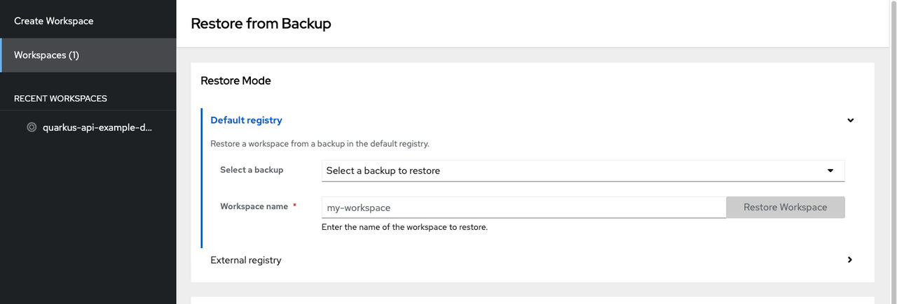
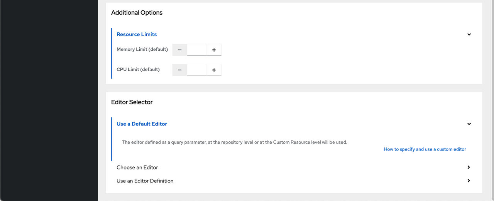

> Source: [Red Hat OpenShift Dev Spaces 3.29](https://docs.redhat.com/en/documentation/red_hat_openshift_dev_spaces/3.29/develop-proc_restoring_a_workspace_from_backup). Copyright Red Hat.
> Adapted from HTML to Markdown for offline use; see [legal notice](LEGAL-NOTICE.md) and [CC BY-SA 3.0](LICENSE.md). Links adjusted; source-fragment gaps are recorded in SOURCE.json.

# Restore a workspace from a backup

Restore a workspace from a backup snapshot through the OpenShift Dev Spaces dashboard to recover uncommitted changes or recreate a workspace environment. When the restoration is complete, the dashboard opens the new workspace in a browser tab.

## Before you begin

- You have backups enabled for your cluster.
- You have identified a default registry or external registry backup image to use.

## Procedure

1.  On the Restore page, select the backup source:
    - **Default registry**: Select a backup from the list.
    - **External registry**: Provide a backup image URL.

    <figure>
     
     

    <figcaption>Figure 1. Restore mode and backup source selection</figcaption>
    </figure>
2.  Enter a name for the restored workspace.
3.  Optional: Configure the memory limits, CPU limits, and the editor.
    <figure>
     
     

    <figcaption>Figure 2. Resource limits and editor selection</figcaption>
    </figure>
4.  Click **Restore Workspace** and wait for the workspace to start.

## Results

- Verify that the restored workspace opens in a new browser tab with the recovered source code.

**Related tasks**  

- [View backups in the dashboard](develop-proc_viewing_backups_in_the_dashboard.md "View the status of your workspace backups in the OpenShift Dev Spaces dashboard. The dashboard displays backups available in the default registry set by the administrator.")
