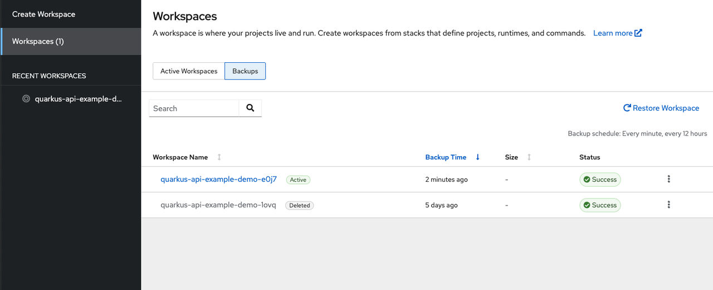

> Source: [Red Hat OpenShift Dev Spaces 3.29](https://docs.redhat.com/en/documentation/red_hat_openshift_dev_spaces/3.29/develop-proc_viewing_backups_in_the_dashboard). Copyright Red Hat.
> Adapted from HTML to Markdown for offline use; see [legal notice](LEGAL-NOTICE.md) and [CC BY-SA 3.0](LICENSE.md). Links adjusted; source-fragment gaps are recorded in SOURCE.json.

# View backups in the dashboard

View the status of your workspace backups in the OpenShift Dev Spaces dashboard. The dashboard displays backups available in the default registry set by the administrator.

## Before you begin

- You have a running OpenShift Dev Spaces instance.
- You have backups enabled for your cluster.

## Procedure

1.  In the OpenShift Dev Spaces dashboard, click **Workspaces**.

2.  Select the **Backups** tab to view available backups.

    <figure>
     
     

    <figcaption>Figure 1. The Backups tab in the Workspace view</figcaption>
    </figure>

    The **Active** tag represents backups for workspaces that still exist in the current cluster. The **Deleted** tag represents backups for workspaces that no longer exist in the current cluster.

**Related tasks**  

- [Restore a workspace from a backup](develop-proc_restoring_a_workspace_from_backup.md "Restore a workspace from a backup snapshot through the OpenShift Dev Spaces dashboard to recover uncommitted changes or recreate a workspace environment. When the restoration is complete, the dashboard opens the new workspace in a browser tab.")
