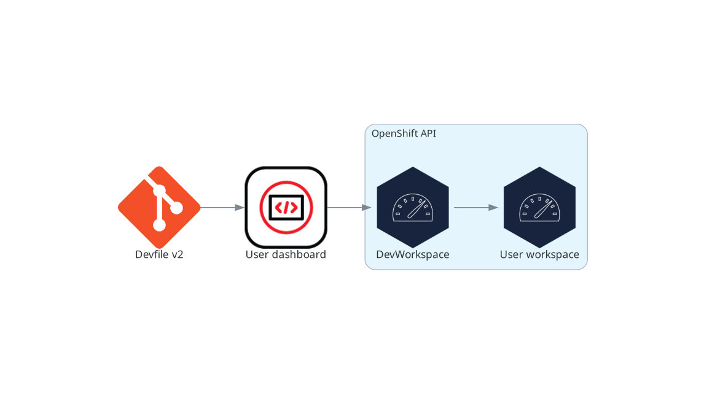

> Source: [Red Hat OpenShift Dev Spaces 3.29](https://docs.redhat.com/en/documentation/red_hat_openshift_dev_spaces/3.29/discover-con_architecture_overview). Copyright Red Hat.
> Adapted from HTML to Markdown for offline use; see [legal notice](LEGAL-NOTICE.md) and [CC BY-SA 3.0](LICENSE.md). Links adjusted; source-fragment gaps are recorded in SOURCE.json.

# OpenShift Dev Spaces architecture

OpenShift Dev Spaces connects three groups of components through Dev Workspace custom resources on OpenShift: server components, the Dev Workspace Operator, and user workspaces. OpenShift RBAC controls access to all resources.

<figure>
 
 

<figcaption>Figure 1. High-level OpenShift Dev Spaces architecture with the Dev Workspace operator</figcaption>
</figure>

OpenShift Dev Spaces runs on three groups of components:

OpenShift Dev Spaces server components  
Manage User project and workspaces. The main component is the User dashboard, from which users control their workspaces.

Dev Workspace operator  
Creates and controls the necessary OpenShift objects to run User workspaces. Including `Pods`, `Services`, and `PersistentVolumes`.

User workspaces  
Container-based development environments, the Integrated Development Environment (IDE) included.

The role of these OpenShift features is central:

Dev Workspace Custom Resources  
Valid OpenShift objects representing the User workspaces and manipulated by OpenShift Dev Spaces. It is the communication channel for the three groups of components.

OpenShift role-based access control (RBAC)  
Controls access to all resources.

Additional resources links to dedicated pages for the server deployments, the Dev Workspace Operator reconciliation loop, and the structure of user workspace pods. The Dev Workspace Operator repository and the OpenShift Custom Resources documentation provide implementation details.

**Related concepts**  

- [What runs on your cluster](discover-con_server_components.md "Your cluster runs four OpenShift Dev Spaces server deployments that manage multi-tenancy and workspace lifecycle.")
- [Dev Workspace Operator and workspace pods](discover-con_devworkspace_operator.md "The Dev Workspace Operator (DWO) manages workspace pods, services, and persistent volumes by reconciling Dev Workspace custom resources on OpenShift. Every OpenShift Dev Spaces workspace has an underlying Dev Workspace CR that contains the devfile, editor definition, and configuration attributes.")
- [What developers get in a workspace](discover-con_user_workspaces.md "Developers get browser-based IDEs running in OpenShift containers, with on-demand access to editors, language servers, debugging tools, and application runtimes without local setup.")

**Related information**  

- [Dev Workspace Operator repository](https://github.com/devfile/devworkspace-operator)
- [Kubernetes documentation - Custom Resources](https://kubernetes.io/docs/concepts/extend-kubernetes/api-extension/custom-resources/)
