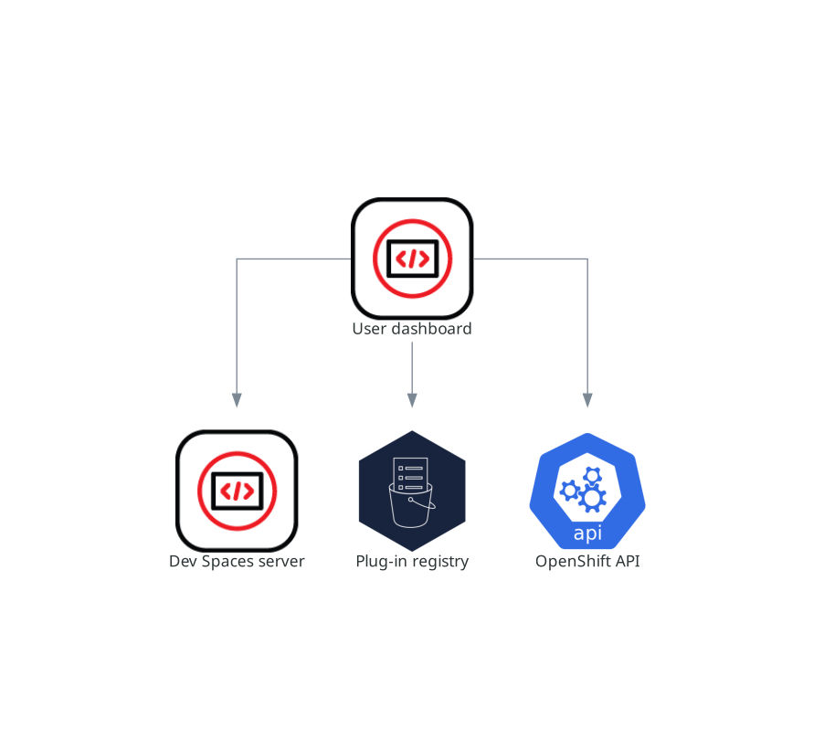

> Source: [Red Hat OpenShift Dev Spaces 3.29](https://docs.redhat.com/en/documentation/red_hat_openshift_dev_spaces/3.29/discover-con_dashboard). Copyright Red Hat.
> Adapted from HTML to Markdown for offline use; see [legal notice](LEGAL-NOTICE.md) and [CC BY-SA 3.0](LICENSE.md). Links adjusted; source-fragment gaps are recorded in SOURCE.json.

# Dashboard and workspace management

The user dashboard is the landing page of Red Hat OpenShift Dev Spaces where users create, manage, and access their workspaces. It coordinates with the OpenShift Dev Spaces server, plug-in registry, and OpenShift API to convert devfiles into running workspace pods.

It is a React application. The OpenShift Dev Spaces deployment starts it in the `devspaces-dashboard` Deployment.

It needs access to the OpenShift Dev Spaces server, the plug-in registry, and the OpenShift Application Programming Interface (API).

<figure>
 
 

<figcaption>Figure 1. User dashboard interactions with other components</figcaption>
</figure>

When the user requests the user dashboard to start a workspace, the user dashboard executes this sequence of actions:

1.  Sends the repository URL to the OpenShift Dev Spaces server and expects a devfile in return, when the user is creating a workspace from a remote devfile.
2.  Reads the devfile describing the workspace.
3.  Collects the additional metadata from the plug-in registry.
4.  Converts the information into a Dev Workspace Custom Resource.
5.  Creates the Dev Workspace Custom Resource in the user project using the OpenShift API.
6.  Watches the Dev Workspace Custom Resource status.
7.  Redirects the user to the running workspace IDE.

**Related concepts**  

- [Server and namespace provisioning](discover-con_devspaces_server.md "The OpenShift Dev Spaces server is a Java web service that creates user namespaces, provisions them with secrets and config maps, and integrates with Git service providers for devfile fetching and authentication.")
- [Plug-in registry](discover-con_plugin_registry.md "The OpenShift Dev Spaces plug-in registry provides extensions for the Visual Studio Code editor.")

**Related information**  

- [Customize the developer dashboard](configure-assembly_configuring_dashboard.md)
