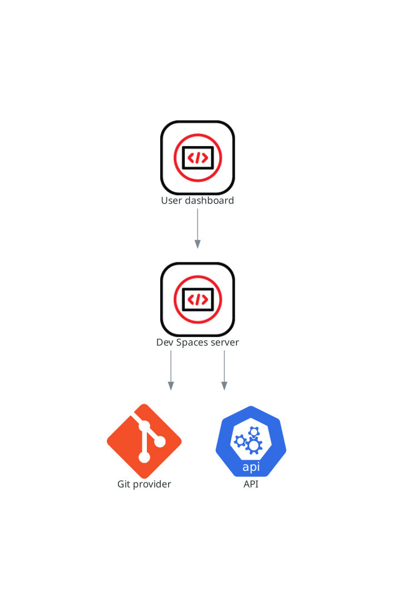

> Source: [Red Hat OpenShift Dev Spaces 3.29](https://docs.redhat.com/en/documentation/red_hat_openshift_dev_spaces/3.29/discover-con_devspaces_server). Copyright Red Hat.
> Adapted from HTML to Markdown for offline use; see [legal notice](LEGAL-NOTICE.md) and [CC BY-SA 3.0](LICENSE.md). Links adjusted; source-fragment gaps are recorded in SOURCE.json.

# Server and namespace provisioning

The OpenShift Dev Spaces server is a Java web service that creates user namespaces, provisions them with secrets and config maps, and integrates with Git service providers for devfile fetching and authentication.

The OpenShift Dev Spaces server main functions are:

- Creating user namespaces.
- Provisioning user namespaces with required secrets and config maps.
- Integrating with Git services providers, to fetch and validate devfiles and authentication.

The OpenShift Dev Spaces server is a Java web service exposing a Hypertext Transfer Protocol (HTTP) REST API and needs access to:

- Git service providers
- OpenShift API

<figure>
 
 

<figcaption>Figure 1. OpenShift Dev Spaces server interactions with other components</figcaption>
</figure>

**Related information**  

- [Fine-tune the OpenShift Dev Spaces server](configure-con_advanced_configuration_devspaces_server.md)
