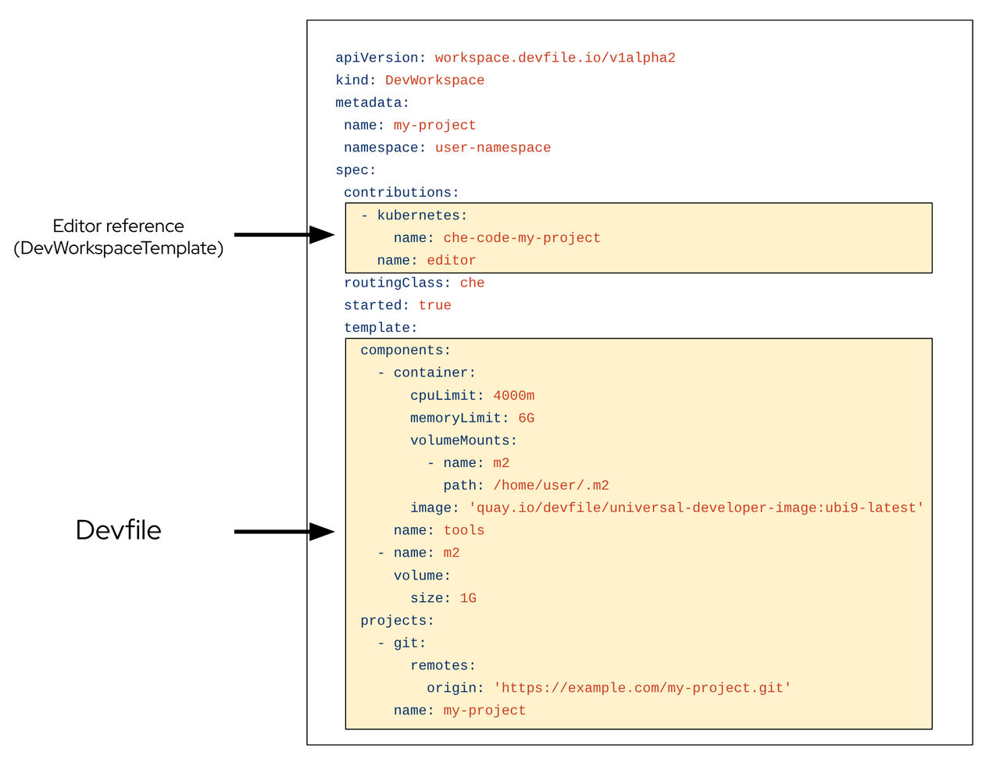

> Source: [Red Hat OpenShift Dev Spaces 3.29](https://docs.redhat.com/en/documentation/red_hat_openshift_dev_spaces/3.29/discover-con_devworkspace_operator). Copyright Red Hat.
> Adapted from HTML to Markdown for offline use; see [legal notice](LEGAL-NOTICE.md) and [CC BY-SA 3.0](LICENSE.md). Links adjusted; source-fragment gaps are recorded in SOURCE.json.

# Dev Workspace Operator and workspace pods

The Dev Workspace Operator (DWO) manages workspace pods, services, and persistent volumes by reconciling Dev Workspace custom resources on OpenShift. Every OpenShift Dev Spaces workspace has an underlying Dev Workspace CR that contains the devfile, editor definition, and configuration attributes.

The Dev Workspace CR is an OpenShift resource representation of an OpenShift Dev Spaces workspace. Whenever a user creates a workspace using OpenShift Dev Spaces in the background, Dashboard OpenShift Dev Spaces creates a Dev Workspace CR in the cluster. For every OpenShift Dev Spaces workspace, there is an underlying Dev Workspace CR on the cluster.

<figure>
 
 

<figcaption>Figure 1. Example of a Dev Workspace CR in a cluster</figcaption>
</figure>

When creating a workspace with OpenShift Dev Spaces with a devfile, the Dev Workspace CR contains the devfile details. Additionally, OpenShift Dev Spaces adds the editor definition into the Dev Workspace CR depending on which editor was chosen for the workspace. OpenShift Dev Spaces also adds attributes to the Dev Workspace that further configure the workspace depending on how you configured the `CheCluster` CR.

A `DevWorkspaceTemplate` is a custom resource that defines a reusable `spec.template` for Dev Workspaces.

When a workspace is started, DWO reads the corresponding Dev Workspace CR and creates the necessary resources such as deployments, secrets, configmaps, and routes. As a result, a workspace pod representing the development environment defined in the devfile is created.

The Dev Workspace Operator provides four Custom Resource Definitions:

- `Dev Workspace` contains devfile details and a reference to the editor definition for each workspace.
- `DevWorkspaceTemplate` defines reusable editor and component templates shared by multiple workspaces.
- `DevWorkspaceOperatorConfig` defines configuration options for the DWO itself.
- `DevWorkspaceRouting` specifies workspace container endpoints and routing.

The configuration guide in Additional resources documents the fields and options available for each of these custom resources. The Dev Workspace Operator source code, including the CRD schemas, is in the linked upstream repository.

**Related information**  

- [Configure the Dev Workspace Operator custom resources](configure-ref_devworkspace_operator_custom_resources.md)
- [Dev Workspace Operator repository](https://github.com/devfile/devworkspace-operator)
