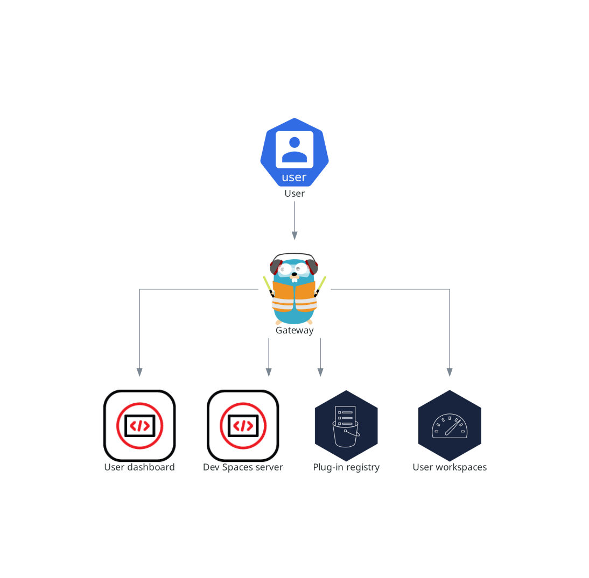

> Source: [Red Hat OpenShift Dev Spaces 3.29](https://docs.redhat.com/en/documentation/red_hat_openshift_dev_spaces/3.29/discover-con_gateway). Copyright Red Hat.
> Adapted from HTML to Markdown for offline use; see [legal notice](LEGAL-NOTICE.md) and [CC BY-SA 3.0](LICENSE.md). Links adjusted; source-fragment gaps are recorded in SOURCE.json.

# Gateway and request routing

The OpenShift Dev Spaces gateway routes requests, authenticates users with OpenID Connect (OIDC), and enforces OpenShift RBAC policies. It controls access to the dashboard, server, plug-in registry, and every user workspace.

The `che-gateway` Deployment contains four containers:

- `gateway` (Traefik) routes requests to the correct backend service.
- `oauth-proxy` (OAuth2 Proxy) authenticates users with OpenID Connect (OIDC).
- `kube-rbac-proxy` applies OpenShift Role Based Access Control (RBAC) policies to control access to any OpenShift Dev Spaces resource.
- `configbump` watches for configuration changes and reloads Traefik routing rules without restarting the Pod.

Each container performs a distinct security and routing function. The security guide in Additional resources covers how to configure the access control policies that these containers enforce, and the Traefik, OAuth2 Proxy, and kube-rbac-proxy project repositories provide upstream documentation for each container.

<figure>
 
 

<figcaption>Figure 1. OpenShift Dev Spaces gateway interactions with other components</figcaption>
</figure>

**Related concepts**  

- [Dashboard and workspace management](discover-con_dashboard.md "The user dashboard is the landing page of Red Hat OpenShift Dev Spaces where users create, manage, and access their workspaces. It coordinates with the OpenShift Dev Spaces server, plug-in registry, and OpenShift API to convert devfiles into running workspace pods.")
- [Server and namespace provisioning](discover-con_devspaces_server.md "The OpenShift Dev Spaces server is a Java web service that creates user namespaces, provisions them with secrets and config maps, and integrates with Git service providers for devfile fetching and authentication.")
- [Plug-in registry](discover-con_plugin_registry.md "The OpenShift Dev Spaces plug-in registry provides extensions for the Visual Studio Code editor.")
- [What developers get in a workspace](discover-con_user_workspaces.md "Developers get browser-based IDEs running in OpenShift containers, with on-demand access to editors, language servers, debugging tools, and application runtimes without local setup.")

**Related information**  

- [Control who can access OpenShift Dev Spaces](secure-assembly_managing_identities_and_authorizations.md)
- [Traefik](https://github.com/traefik/traefik)
- [OAuth2 Proxy](https://github.com/oauth2-proxy/oauth2-proxy)
- [kube-rbac-proxy](https://github.com/brancz/kube-rbac-proxy)
