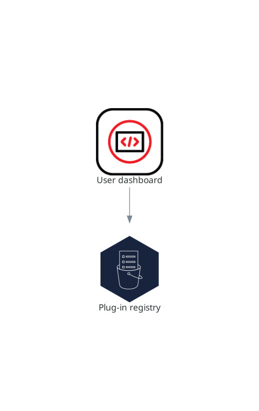

> Source: [Red Hat OpenShift Dev Spaces 3.29](https://docs.redhat.com/en/documentation/red_hat_openshift_dev_spaces/3.29/discover-con_plugin_registry). Copyright Red Hat.
> Adapted from HTML to Markdown for offline use; see [legal notice](LEGAL-NOTICE.md) and [CC BY-SA 3.0](LICENSE.md). Links adjusted; source-fragment gaps are recorded in SOURCE.json.

# Plug-in registry

The OpenShift Dev Spaces plug-in registry provides extensions for the Visual Studio Code editor.

The online instance linked in Additional resources provides the latest community version of the registry.

<figure>
 
 

<figcaption>Figure 1. Plugin registries interactions with other components</figcaption>
</figure>

**Related information**  

- [Plugin registry latest community version online instance](https://eclipse-che.github.io/che-plugin-registry/main/index.json)
