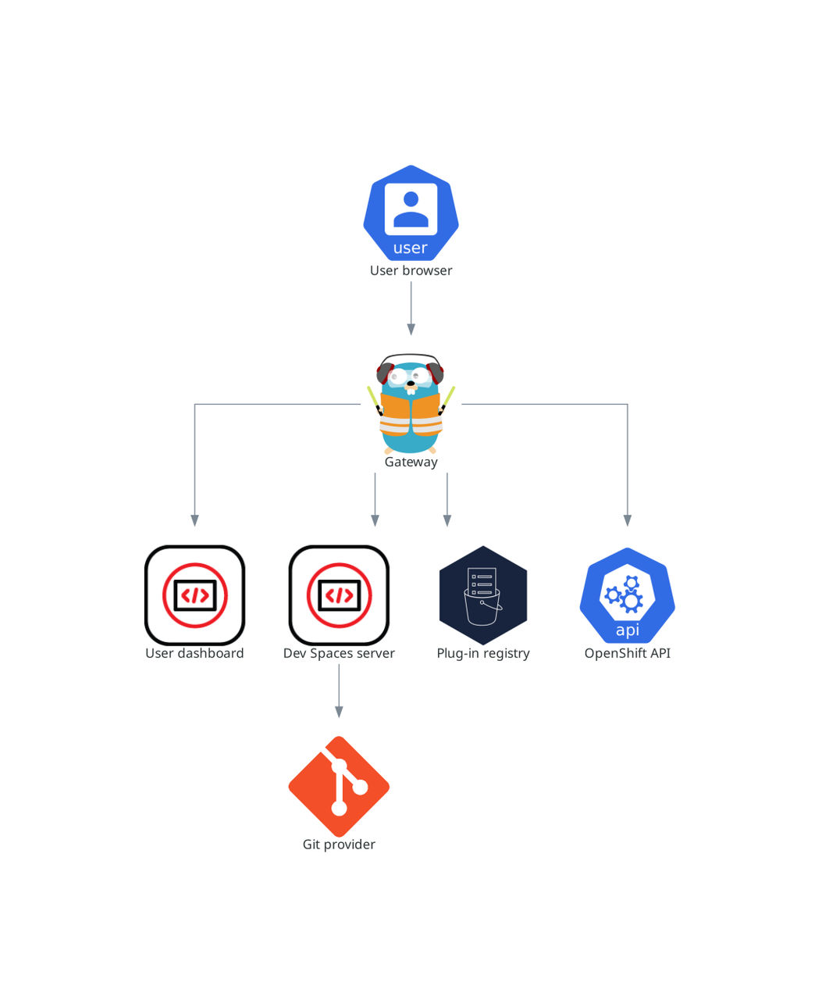

> Source: [Red Hat OpenShift Dev Spaces 3.29](https://docs.redhat.com/en/documentation/red_hat_openshift_dev_spaces/3.29/discover-con_server_components). Copyright Red Hat.
> Adapted from HTML to Markdown for offline use; see [legal notice](LEGAL-NOTICE.md) and [CC BY-SA 3.0](LICENSE.md). Links adjusted; source-fragment gaps are recorded in SOURCE.json.

# What runs on your cluster

Your cluster runs four OpenShift Dev Spaces server deployments that manage multi-tenancy and workspace lifecycle.

<figure>
 
 

<figcaption>Figure 1. OpenShift Dev Spaces server components interacting with the Dev Workspace operator</figcaption>
</figure>

**Related concepts**  

- [Operator and lifecycle management](discover-con_devspaces_operator.md "The OpenShift Dev Spaces Operator manages the full lifecycle of OpenShift Dev Spaces server components through the CheCluster custom resource. Creating a CheCluster CR triggers the Operator to deploy the Dev Workspace Operator, gateway, dashboard, server, and plug-in registry.")
- [Gateway and request routing](discover-con_gateway.md "The OpenShift Dev Spaces gateway routes requests, authenticates users with OpenID Connect (OIDC), and enforces OpenShift RBAC policies. It controls access to the dashboard, server, plug-in registry, and every user workspace.")
- [Dashboard and workspace management](discover-con_dashboard.md "The user dashboard is the landing page of Red Hat OpenShift Dev Spaces where users create, manage, and access their workspaces. It coordinates with the OpenShift Dev Spaces server, plug-in registry, and OpenShift API to convert devfiles into running workspace pods.")
- [Server and namespace provisioning](discover-con_devspaces_server.md "The OpenShift Dev Spaces server is a Java web service that creates user namespaces, provisions them with secrets and config maps, and integrates with Git service providers for devfile fetching and authentication.")
- [Plug-in registry](discover-con_plugin_registry.md "The OpenShift Dev Spaces plug-in registry provides extensions for the Visual Studio Code editor.")
