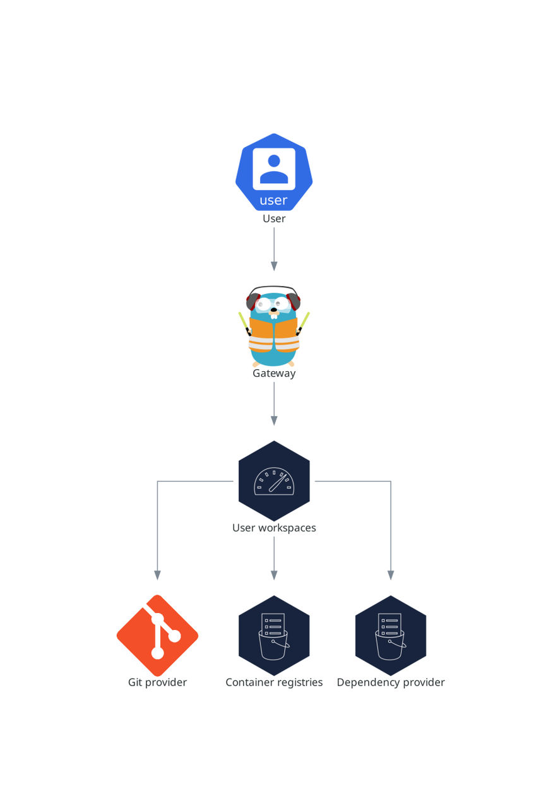
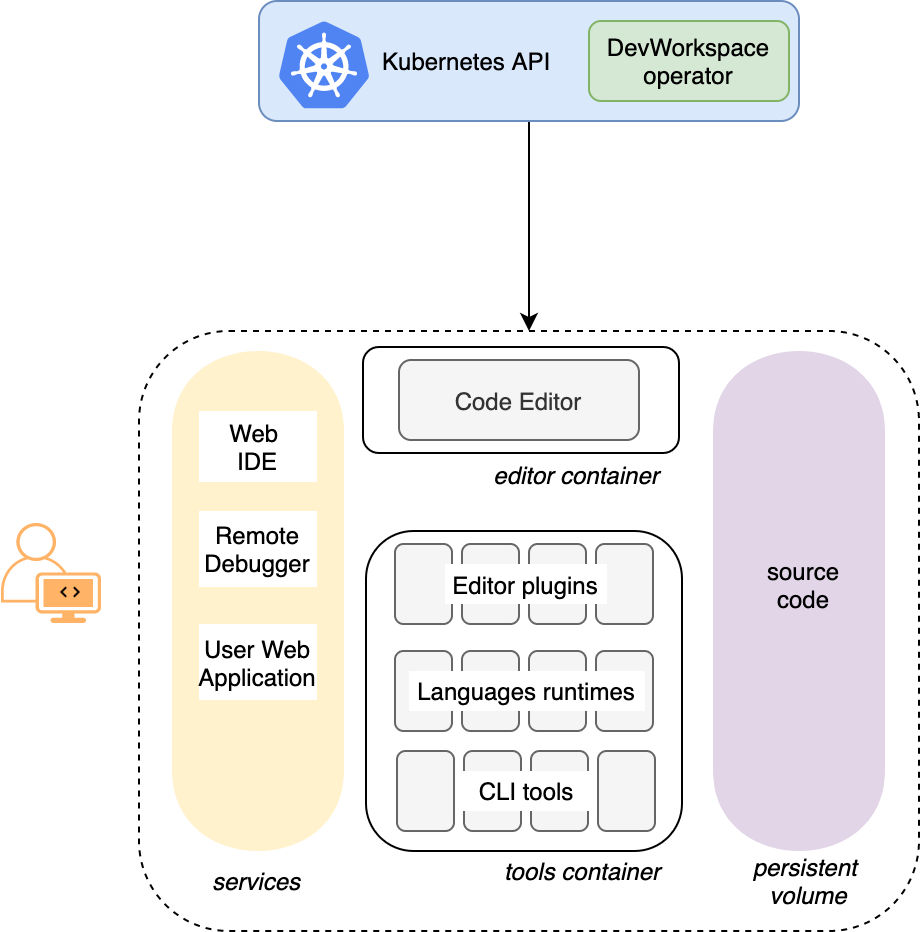

> Source: [Red Hat OpenShift Dev Spaces 3.29](https://docs.redhat.com/en/documentation/red_hat_openshift_dev_spaces/3.29/discover-con_user_workspaces). Copyright Red Hat.
> Adapted from HTML to Markdown for offline use; see [legal notice](LEGAL-NOTICE.md) and [CC BY-SA 3.0](LICENSE.md). Links adjusted; source-fragment gaps are recorded in SOURCE.json.

# What developers get in a workspace

Developers get browser-based IDEs running in OpenShift containers, with on-demand access to editors, language servers, debugging tools, and application runtimes without local setup.

<figure>
 
 

<figcaption>Figure 1. User workspaces interactions with other components</figcaption>
</figure>

Each workspace runs as an OpenShift Pod containing the IDE, language servers, debugging tools, and application runtimes. Developers interact with the workspace through a browser-based editor or a desktop IDE connected over SSH.

A workspace Pod includes:

- An editor container (Visual Studio Code - Open Source by default, or JetBrains through Gateway)
- A tools container with language servers, compilers, and CLIs defined in the devfile
- A gateway sidecar for request routing

Supporting OpenShift resources created for each workspace:

- A Persistent Volume for project source code (persisted across restarts)
- Services and Routes for IDE endpoint access
- Secrets for Git credentials and workspace configuration
- ConfigMaps for environment-specific settings

The devfile v2 format specifies which tools and runtimes a workspace includes. When a workspace starts, the Dev Workspace Operator reads the devfile and creates all necessary OpenShift resources.

<figure>
 
 

<figcaption>Figure 2. OpenShift Dev Spaces workspace components</figcaption>
</figure>
