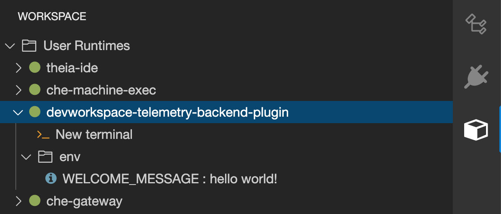

> Source: [Red Hat OpenShift Dev Spaces 3.29](https://docs.redhat.com/en/documentation/red_hat_openshift_dev_spaces/3.29/extend-proc_configuring_workspaces_to_load_telemetry_plugin). Copyright Red Hat.
> Adapted from HTML to Markdown for offline use; see [legal notice](LEGAL-NOTICE.md) and [CC BY-SA 3.0](LICENSE.md). Links adjusted; source-fragment gaps are recorded in SOURCE.json.

<span id="ariaid-title1"></span>

# Configure workspaces to load a telemetry plugin

Configure Dev Workspaces to load the telemetry plugin so that workspace activity events are sent to your telemetry backend for collection and analysis.

## Before you begin

- You have an active `oc` session with administrative permissions to the OpenShift cluster. See [Getting started with the CLI](https://docs.openshift.com/container-platform/4.22/cli_reference/openshift_cli/getting-started-cli.html).
- You have a running instance of Red Hat OpenShift Dev Spaces.
- You have a telemetry plugin deployed and hosted on a web server. See [Deploy a telemetry plugin](extend-proc_deploying_a_telemetry_plugin.md "Deploy the telemetry backend as a container image, create a devfile v2 plugin, and host the plugin on a web server so that Dev Workspaces can load it.").

## Procedure

1.  Add the telemetry plugin to the `components` field of an existing Dev Workspace:

    ``` yaml
    components:
      ...
      - name: telemetry-plugin
        plugin:
          uri: <telemetry_plugin_url>
    ```

2.  Start the Dev Workspace from the OpenShift Dev Spaces dashboard.

3.  Optional: Configure the `CheCluster` Custom Resource to apply the telemetry plugin as a default for all Dev Workspaces. Default plugins are applied on Dev Workspace startup for new and existing Dev Workspaces.

    ``` yaml
    spec:
      devEnvironments:
        defaultPlugins:
        - editor: che-incubator/che-code/latest
          plugins:
          - '<telemetry_plugin_url>'
    ```

    where:

    `editor`  
    The editor identification to set the default plugins for.

    `plugins`  
    List of URLs to devfile v2 plugins.

## Results

1.  Verify that the telemetry plugin container is running in the Dev Workspace pod by checking the Workspace view within the editor.  
      
2.  Edit files within the editor and observe their events in the example telemetry server’s logs.

**Related concepts**  

- [How telemetry plugins work](extend-con_telemetry_plugin_overview.md "A telemetry plugin for OpenShift Dev Spaces collects workspace usage data and sends it to your analytics backend. The plugin extends the AbstractAnalyticsManager class with methods for event handling, activity tracking, and shutdown.")

**Related information**  

- [Configure the CheCluster Custom Resource using the CLI](configure-proc_using_cli_to_configure_checluster.md)
