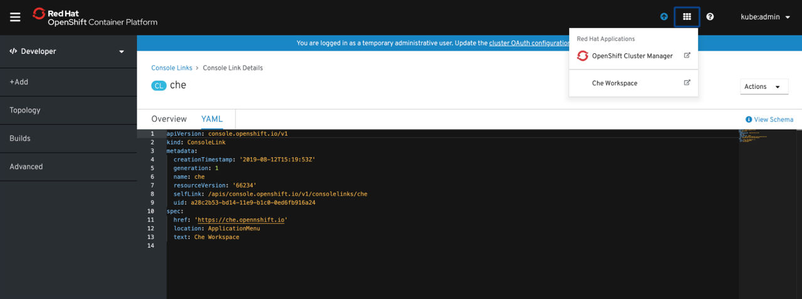

> Source: [Red Hat OpenShift Dev Spaces 3.29](https://docs.redhat.com/en/documentation/red_hat_openshift_dev_spaces/3.29/integrate-proc_accessing_devspaces_from_openshift_menu). Copyright Red Hat.
> Adapted from HTML to Markdown for offline use; see [legal notice](LEGAL-NOTICE.md) and [CC BY-SA 3.0](LICENSE.md). Links adjusted; source-fragment gaps are recorded in SOURCE.json.

# Access OpenShift Dev Spaces from Red Hat Applications menu

Access OpenShift Dev Spaces directly from the **Red Hat Applications** menu on OpenShift Container Platform to reach the Dashboard without navigating away from your current OpenShift context. .Prerequisites

## About this task

- You have the OpenShift Dev Spaces Operator available in OpenShift 4.

## Procedure

1.  Open the **Red Hat Applications** menu by using the three-by-three matrix icon in the upper right corner of the main screen.

    The drop-down menu displays the available applications.

      
      

2.  Click the **OpenShift Dev Spaces** link to open the Red Hat OpenShift Dev Spaces Dashboard.

**Related concepts**  

- [How workspaces connect to OpenShift](integrate-con_integrating_with_openshift.md "OpenShift Dev Spaces workspaces connect to OpenShift through automatic token injection, the OpenShift CLI, and console navigation.")
- [How OpenShift Dev Spaces appears in the OpenShift console](integrate-con_navigating_devspaces_from_openshift_developer_perspective.md "OpenShift Dev Spaces appears in the OpenShift console through a ConsoleLink Custom Resource that adds an interactive link to the Red Hat Applications menu. When the OpenShift Dev Spaces Operator is deployed into OpenShift Container Platform 4.2 and later, it creates a ConsoleLink Custom Resource (CR). This adds an interactive link to the Red Hat Applications menu for accessing the OpenShift Dev Spaces installation. To access the menu, click the three-by-three matrix icon on the main screen of the OpenShift web console. The OpenShift Dev Spaces Console Link creates a new workspace or redirects you to an existing one. For step-by-step instructions, see Additional resources.")

**Related tasks**  

- [List workspaces from the command line](integrate-proc_listing_all_workspaces.md "List workspaces from the command line to check their status, identify stopped or failed workspaces, and monitor resource usage across your OpenShift Dev Spaces environment. .Prerequisites")
