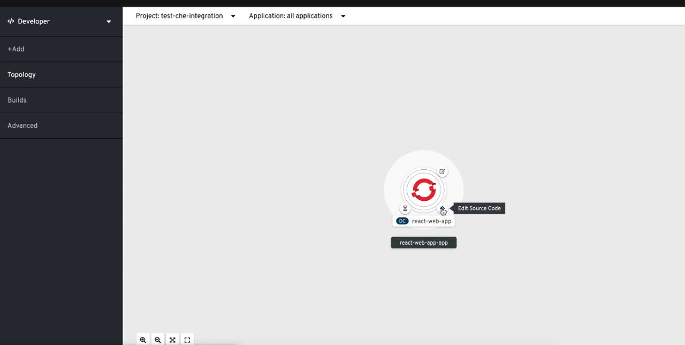

> Source: [Red Hat OpenShift Dev Spaces 3.29](https://docs.redhat.com/en/documentation/red_hat_openshift_dev_spaces/3.29/integrate-proc_editing_code_from_openshift_developer_perspective). Copyright Red Hat.
> Adapted from HTML to Markdown for offline use; see [legal notice](LEGAL-NOTICE.md) and [CC BY-SA 3.0](LICENSE.md). Links adjusted; source-fragment gaps are recorded in SOURCE.json.

# Edit application code from the OpenShift Developer Perspective

Edit the source code of applications running on OpenShift directly from the Developer Perspective to fix and iterate on deployed components without switching tools. .Prerequisites

## About this task

- You have OpenShift Dev Spaces deployed on the same OpenShift 4 cluster.

## Procedure

1.  Open the **Topology** view to list all projects.

2.  In the **Select an Application** search field, type `workspace` to list all workspaces.

3.  Click the workspace to edit.

    The deployments are displayed as graphical circles surrounded by circular buttons. One of these buttons is **Edit Source Code**.

      
      

4.  Click the **Edit Source Code** button. This redirects to a workspace with the cloned source code of the application component.

**Related concepts**  

- [How workspaces connect to OpenShift](integrate-con_integrating_with_openshift.md "OpenShift Dev Spaces workspaces connect to OpenShift through automatic token injection, the OpenShift CLI, and console navigation.")
- [How OpenShift Dev Spaces appears in the OpenShift console](integrate-con_navigating_devspaces_from_openshift_developer_perspective.md "OpenShift Dev Spaces appears in the OpenShift console through a ConsoleLink Custom Resource that adds an interactive link to the Red Hat Applications menu. When the OpenShift Dev Spaces Operator is deployed into OpenShift Container Platform 4.2 and later, it creates a ConsoleLink Custom Resource (CR). This adds an interactive link to the Red Hat Applications menu for accessing the OpenShift Dev Spaces installation. To access the menu, click the three-by-three matrix icon on the main screen of the OpenShift web console. The OpenShift Dev Spaces Console Link creates a new workspace or redirects you to an existing one. For step-by-step instructions, see Additional resources.")

**Related tasks**  

- [List workspaces from the command line](integrate-proc_listing_all_workspaces.md "List workspaces from the command line to check their status, identify stopped or failed workspaces, and monitor resource usage across your OpenShift Dev Spaces environment. .Prerequisites")
