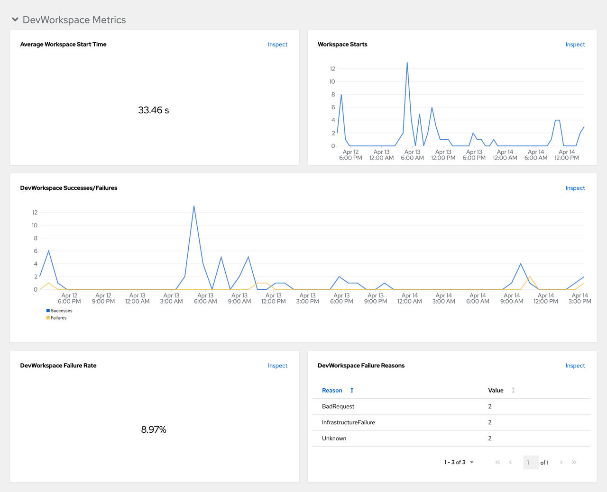
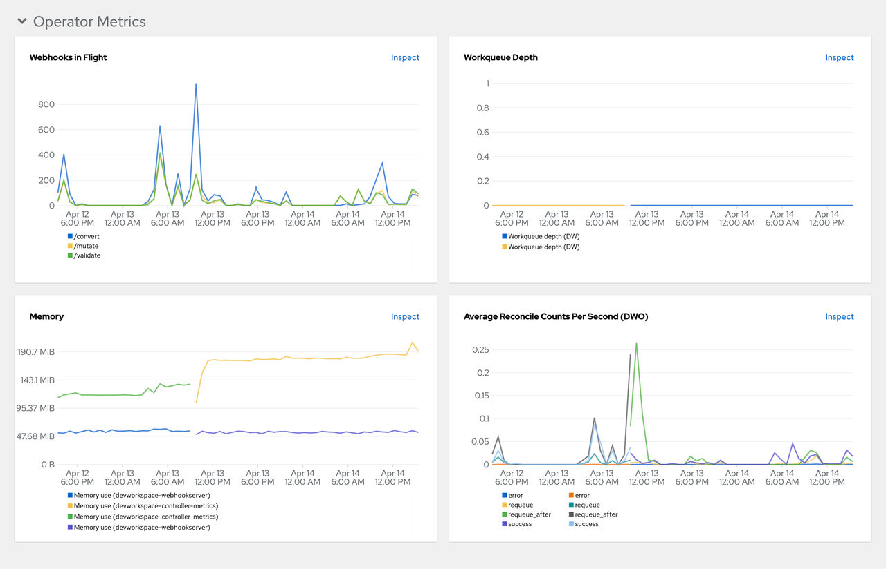

> Source: [Red Hat OpenShift Dev Spaces 3.29](https://docs.redhat.com/en/documentation/red_hat_openshift_dev_spaces/3.29/observe-con_monitoring_devworkspace_operator). Copyright Red Hat.
> Adapted from HTML to Markdown for offline use; see [legal notice](LEGAL-NOTICE.md) and [CC BY-SA 3.0](LICENSE.md). Links adjusted; source-fragment gaps are recorded in SOURCE.json.

# What Dev Workspace Operator metrics reveal

The Dev Workspace Operator exposes workspace startup, failure, and performance metrics on port `8443` on the `/metrics` endpoint of the `devworkspace-controller-metrics` Service. The OpenShift in-cluster monitoring stack can scrape these metrics to help administrators track workspace health and diagnose startup failures. For the Prometheus verification procedure, see Additional resources.

## [Dev Workspace-specific metrics](observe-con_monitoring_devworkspace_operator.md#con_monitoring-devworkspace-operator_devspaces___dev_workspace_specific_metrics)

The following tables describe the Dev Workspace-specific metrics exposed by the `devworkspace-controller-metrics` Service.

| Name | Type | Description | Labels |
|----|----|----|----|
| `devworkspace_started_total` | Counter | Number of Dev Workspace starting events. | `source`, `routingclass` |
| `devworkspace_started_success_total` | Counter | Number of Dev Workspaces successfully entering the `Running` phase. | `source`, `routingclass` |
| `devworkspace_fail_total` | Counter | Number of failed Dev Workspaces. | `source`, `reason` |
| `devworkspace_startup_time` | Histogram | Total time taken to start a Dev Workspace, in seconds. | `source`, `routingclass` |

Table 1. Metrics

| Name | Description | Values |
|----|----|----|
| `source` | The `controller.devfile.io/devworkspace-source` label of the Dev Workspace. | `string` |
| `routingclass` | The `spec.routingclass` of the Dev Workspace. | `"basic\|cluster\|cluster-tls\|web-terminal"` |
| `reason` | The workspace startup failure reason. | `"BadRequest\|InfrastructureFailure\|Unknown"` |

Table 2. Labels

| Name | Description |
|----|----|
| `BadRequest` | Startup failure due to an invalid devfile used to create a Dev Workspace. |
| `InfrastructureFailure` | Startup failure due to the following errors: `CreateContainerError`, `RunContainerError`, `FailedScheduling`, `FailedMount`. |
| `Unknown` | Unknown failure reason. |

Table 3. Startup failure reasons

## [Dev Workspace Operator dashboard panels](observe-con_monitoring_devworkspace_operator.md#con_monitoring-devworkspace-operator_devspaces___dev_workspace_operator_dashboard_panels)

The OpenShift web console custom dashboard is based on Grafana 6.x and displays the following metrics from the Dev Workspace Operator.

Note

Not all features for Grafana 6.x dashboards are supported as an OpenShift web console dashboard.

The **Dev Workspace Metrics** panel displays Dev Workspace-specific metrics.

<figure>
 
 

<figcaption>Figure 1. The Dev Workspace Metrics panel</figcaption>
</figure>

Average workspace start time  
The average workspace startup duration.

Workspace starts  
The number of successful and failed workspace startups.

Dev Workspace successes and failures  
A comparison between successful and failed Dev Workspace startups.

Dev Workspace failure rate  
The ratio between the number of failed workspace startups and the number of total workspace startups.

Dev Workspace startup failure reasons  
A pie chart that displays the distribution of workspace startup failures:

- `BadRequest`
- `InfrastructureFailure`
- `Unknown`

The **Operator Metrics** panel displays Operator-specific metrics.

<figure>
 
 

<figcaption>Figure 2. The Operator Metrics panel</figcaption>
</figure>

Webhooks in flight  
A comparison between the number of different webhook requests.

Work queue depth  
The number of reconcile requests that are in the work queue.

Memory  
Memory usage for the Dev Workspace controller and the Dev Workspace webhook server.

Average reconcile counts per second (DWO)  
The average per-second number of reconcile counts for the Dev Workspace controller.

For the procedure to create this dashboard in the OpenShift web console, see Additional resources.

**Related tasks**  

- [Verify Dev Workspace Operator metrics collection with Prometheus](observe-proc_collecting_devworkspace_operator_metrics_with_prometheus.md "Verify that Dev Workspace Operator metrics are available in Prometheus. The OpenShift Dev Spaces Operator automatically creates and reconciles the required Prometheus resources (ServiceMonitor, Role, and RoleBinding) and configures namespace labeling.")
- [View Dev Workspace Operator metrics from an OpenShift web console dashboard](observe-proc_viewing_devworkspace_operator_from_openshift_dashboard.md "View Dev Workspace Operator metrics on a custom dashboard in the Administrator perspective of the OpenShift web console. This dashboard helps you monitor operator health and detect workspace provisioning issues.")

**Related information**  

- [OpenShift Documentation: Managing metrics](https://docs.openshift.com/container-platform/4.22/monitoring/managing-metrics.html)
