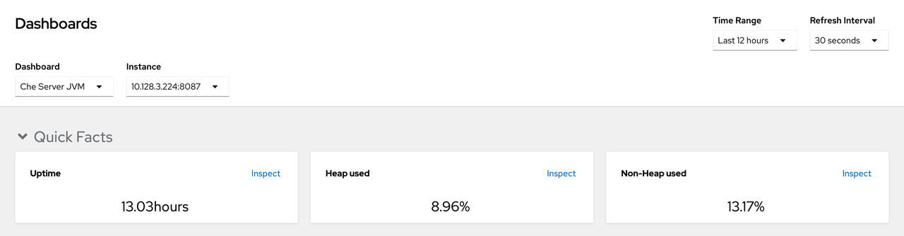
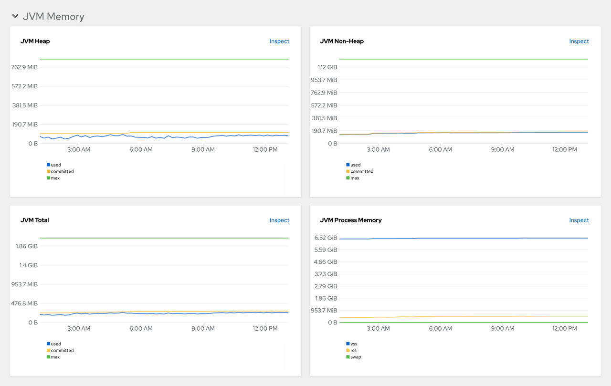
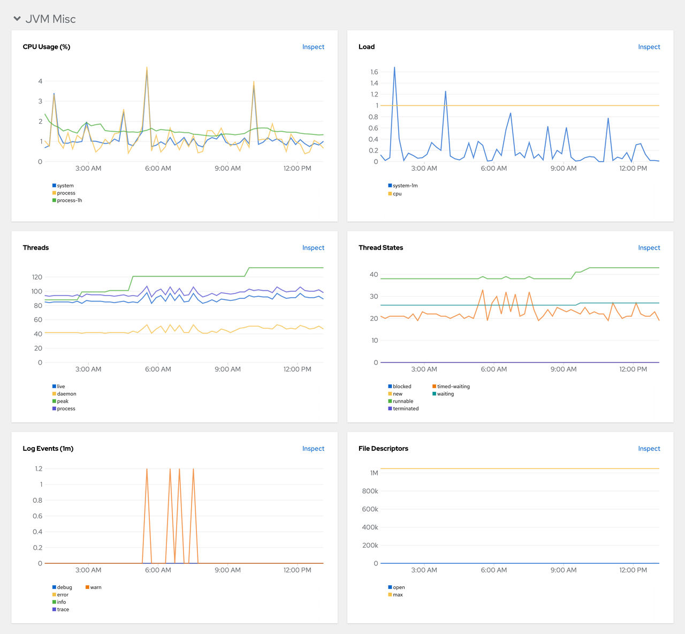
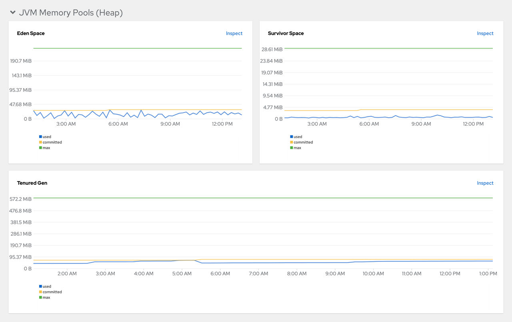
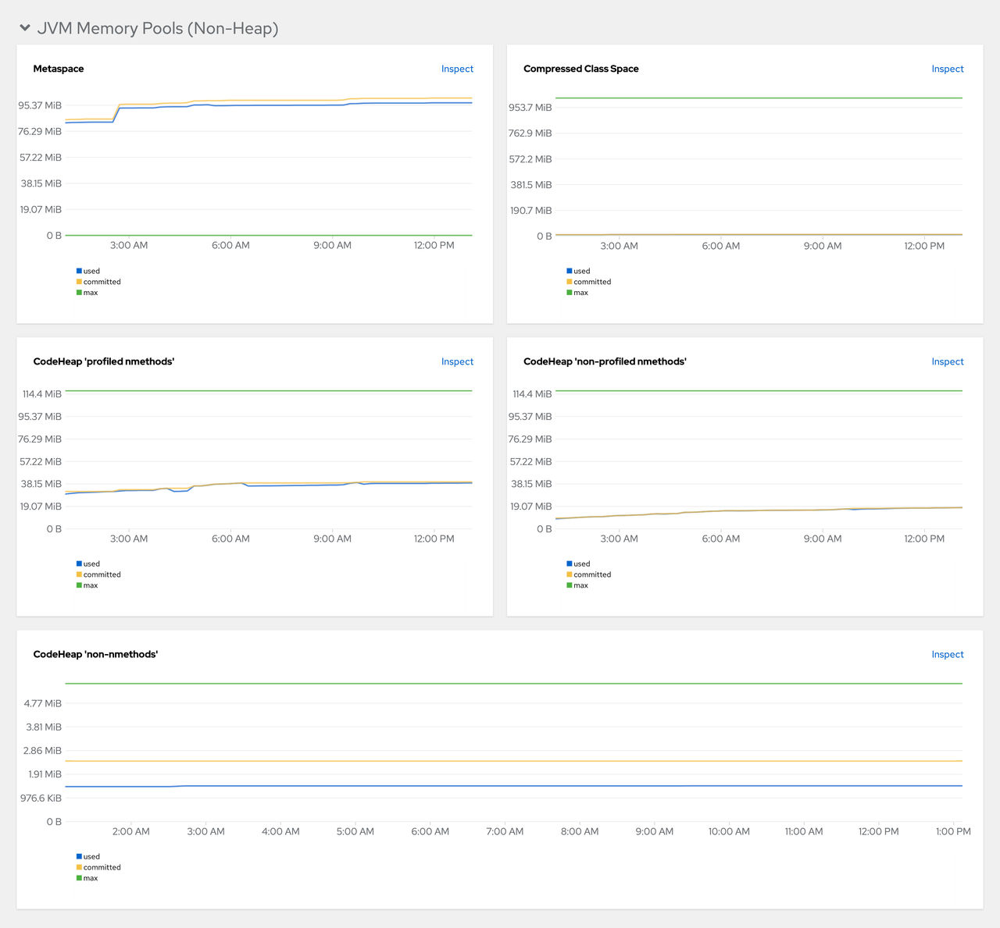
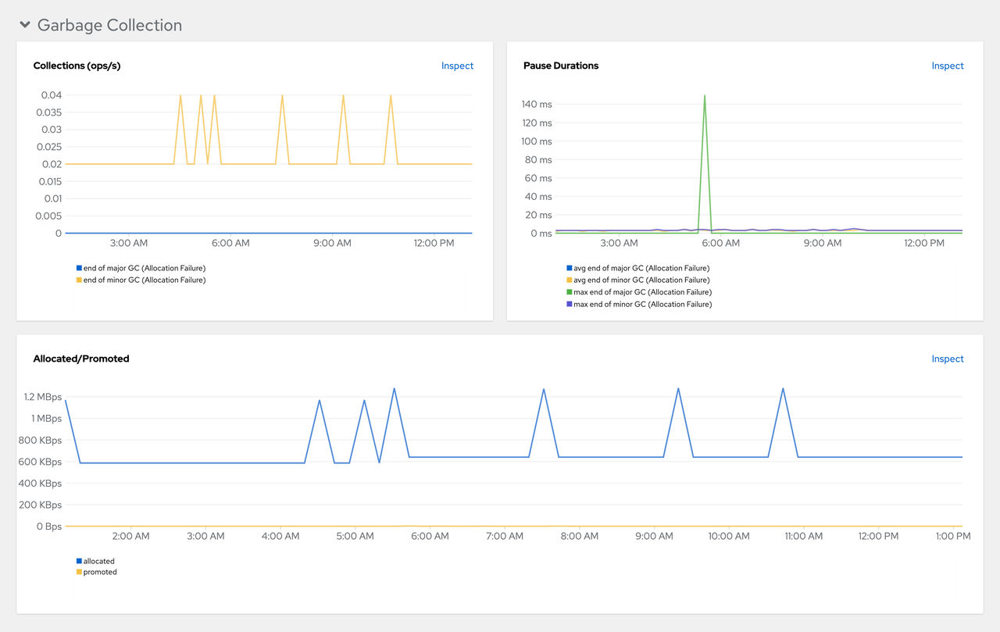
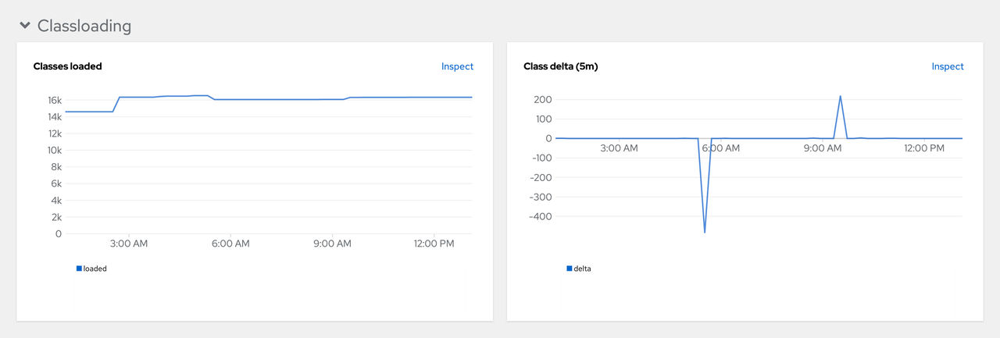
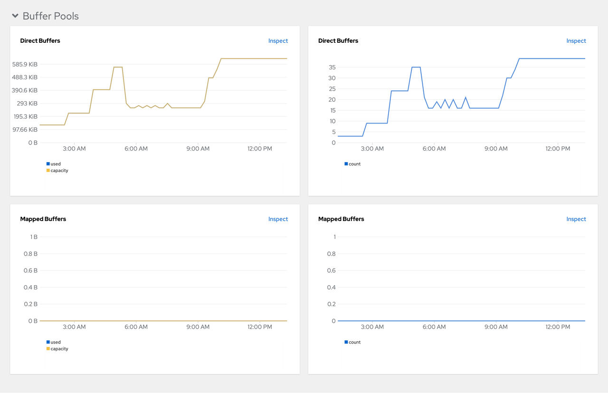

> Source: [Red Hat OpenShift Dev Spaces 3.29](https://docs.redhat.com/en/documentation/red_hat_openshift_dev_spaces/3.29/observe-proc_viewing_devspaces_server_from_openshift_dashboard). Copyright Red Hat.
> Adapted from HTML to Markdown for offline use; see [legal notice](LEGAL-NOTICE.md) and [CC BY-SA 3.0](LICENSE.md). Links adjusted; source-fragment gaps are recorded in SOURCE.json.

<span id="ariaid-title1"></span>

# View OpenShift Dev Spaces Server from an OpenShift web console dashboard

View OpenShift Dev Spaces Server JVM metrics on a custom dashboard in the **Administrator** perspective of the OpenShift web console. This dashboard helps you identify performance bottlenecks and monitor server health.

## Before you begin

- You have an instance of OpenShift Dev Spaces installed and running in OpenShift.
- You have an active `oc` session with administrative permissions to the OpenShift cluster. See [Getting started with the CLI](https://docs.openshift.com/container-platform/4.22/cli_reference/openshift_cli/getting-started-cli.html).
- The in-cluster Prometheus instance is collecting metrics. See [Verify OpenShift Dev Spaces Server metrics collection with Prometheus](observe-proc_collecting_devspaces_metrics_with_prometheus.md "Verify that OpenShift Dev Spaces Server JVM metrics are available in Prometheus. The OpenShift Dev Spaces Operator automatically creates and reconciles the required Prometheus resources (ServiceMonitor, Role, and RoleBinding) and configures namespace labeling.").

## Procedure

Create a ConfigMap for the dashboard definition in the `openshift-config-managed` project and apply the necessary label.

1.  Create the ConfigMap:

    ``` bash
    $ oc create configmap grafana-dashboard-devspaces-server \
      --from-literal=devspaces-server-dashboard.json="$(curl https://raw.githubusercontent.com/eclipse-che/che-server/main/docs/grafana/openshift-console-dashboard.json)" \
      -n openshift-config-managed
    ```

    Note

    The previous command contains a link to material from the upstream community. This material represents the very latest available content and the most recent best practices. These tips have not yet been vetted by Red Hat's QE department, and they have not yet been proven by a wide user group. Please, use this information cautiously.

2.  Apply the dashboard label:

    ``` bash
    $ oc label configmap grafana-dashboard-devspaces-server console.openshift.io/dashboard=true -n openshift-config-managed
    ```

    Note

    The dashboard definition is based on Grafana 6.x dashboards. Not all Grafana 6.x dashboard features are supported in the OpenShift web console.

## Results

1.  In the **Administrator** view of the OpenShift web console, go to **Observe** **Dashboards**.
2.  Go to **Dashboard** **Che Server JVM** and verify that the dashboard panels contain data.
    <figure>
    <br />
    <br />

    <figcaption>Figure 1. Quick Facts</figcaption>
    </figure>

    <figure>
    <br />
    <br />

    <figcaption>Figure 2. JVM Memory</figcaption>
    </figure>

    <figure>
    <br />
    <br />

    <figcaption>Figure 3. JVM Misc</figcaption>
    </figure>

    <figure>
    <br />
    <br />

    <figcaption>Figure 4. JVM Memory Pools (heap)</figcaption>
    </figure>

    <figure>
    <br />
    <br />

    <figcaption>Figure 5. JVM Memory Pools (Non-Heap)</figcaption>
    </figure>

    <figure>
    <br />
    <br />

    <figcaption>Figure 6. Garbage Collection</figcaption>
    </figure>

    <figure>
    <br />
    <br />

    <figcaption>Figure 7. Class loading</figcaption>
    </figure>

    <figure>
    <br />
    <br />

    <figcaption>Figure 8. Buffer Pools</figcaption>
    </figure>

**Related tasks**  

- [Enable OpenShift Dev Spaces server metrics](observe-proc_enabling_devspaces_metrics.md "Enable the OpenShift Dev Spaces JVM metrics endpoint on port 8087 of the che-host Service to support performance monitoring and capacity planning.")
- [Verify OpenShift Dev Spaces Server metrics collection with Prometheus](observe-proc_collecting_devspaces_metrics_with_prometheus.md "Verify that OpenShift Dev Spaces Server JVM metrics are available in Prometheus. The OpenShift Dev Spaces Operator automatically creates and reconciles the required Prometheus resources (ServiceMonitor, Role, and RoleBinding) and configures namespace labeling.")

**Related information**  

- [OpenShift Documentation: Managing metrics](https://docs.openshift.com/container-platform/4.22/monitoring/managing-metrics.html)
