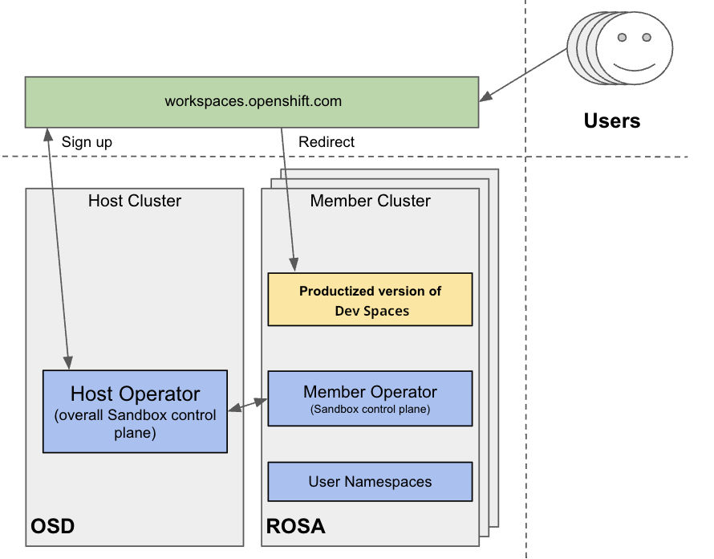

> Source: [Red Hat OpenShift Dev Spaces 3.29](https://docs.redhat.com/en/documentation/red_hat_openshift_dev_spaces/3.29/plan-con_running_at_scale). Copyright Red Hat.
> Adapted from HTML to Markdown for offline use; see [legal notice](LEGAL-NOTICE.md) and [CC BY-SA 3.0](LICENSE.md). Links adjusted; source-fragment gaps are recorded in SOURCE.json.

<span id="ariaid-title1"></span>

# Scalability limits and multi-cluster deployments

Scaling cloud development environments to thousands of concurrent workspaces strains etcd, Operator memory, and worker nodes. Review bottlenecks, tested maximums, and multi-cluster deployment patterns.

Such a scale imposes high infrastructure demands and introduces potential bottlenecks that can impact performance and stability. Addressing these challenges requires meticulous planning, strategic architectural choices, monitoring, and continuous optimization.

CDE workloads are particularly complex to scale. The underlying IDE solutions, such as Visual Studio Code - Open Source ("Code - OSS") or JetBrains Gateway, are designed as single-user applications, not as multitenant services.

<span id="con_running-at-scale_devspaces___tested_cluster_maximums_that_constrain_scaling"></span>

## [Tested cluster maximums that constrain scaling](plan-con_running_at_scale.md#con_running-at-scale_devspaces___tested_cluster_maximums_that_constrain_scaling)

While there is no strict limit on the number of resources in a Kubernetes cluster, there are certain considerations for large clusters to remember.

OpenShift Container Platform, a certified distribution of Kubernetes, provides a set of tested maximums for various resources. These maximums can serve as an initial guideline for planning your environment:

<span id="con_running-at-scale_devspaces___tested_cluster_maximums_that_constrain_scaling__entry__1"></span><span id="con_running-at-scale_devspaces___tested_cluster_maximums_that_constrain_scaling__entry__2"></span>

| Resource type           | Tested maximum |
|-------------------------|----------------|
| Number of nodes         | 2000           |
| Number of pods          | 150000         |
| Number of pods per node | 2500           |
| Number of namespace     | 10000          |
| Number of services      | 10000          |
| Number of secrets       | 80000          |
| Number of config maps   | 90000          |

Table 1. OpenShift Container Platform tested cluster maximums

For more details on OpenShift Container Platform tested object maximums, see Additional resources.

For example, it is generally not recommended to have more than 10,000 namespaces due to potential performance and management cost. In Red Hat OpenShift Dev Spaces, each user is allocated a namespace. If you expect the user base to be large, consider spreading workloads across multiple "fit-for-purpose" clusters and potentially using solutions for multi-cluster orchestration.

<span id="con_running-at-scale_devspaces___how_workspace_size_determines_cluster_capacity"></span>

## [How workspace size determines cluster capacity](plan-con_running_at_scale.md#con_running-at-scale_devspaces___how_workspace_size_determines_cluster_capacity)

When deploying Red Hat OpenShift Dev Spaces on Kubernetes, accurately calculate the resource requirements for each CDE, including memory and CPU or GPU needs. This determines the right sizing of the cluster. In general, the CDE size is limited by and cannot be bigger than the worker node size.

The resource requirements for CDEs can vary significantly based on the specific workloads and configurations. A simple CDE might require only a few hundred megabytes of memory. A more complex one might need several gigabytes of memory and multiple CPU cores.

For details about calculating resource requirements, see Additional resources.

<span id="con_running-at-scale_devspaces___how_etcd_limits_cluster_scale"></span>

## [How etcd limits cluster scale](plan-con_running_at_scale.md#con_running-at-scale_devspaces___how_etcd_limits_cluster_scale)

The primary datastore of Kubernetes cluster configuration and state is etcd. It holds information about nodes, pods, services, and custom resources.

As a distributed key-value store, etcd does not scale well past a certain threshold. As the size of etcd grows, so does the load on the cluster, risking its stability.

Important

The default etcd size is 2 GB, and the recommended maximum is 8 GB. Exceeding the maximum limit can make the Kubernetes cluster unstable and unresponsive. Even though the data stored in a `ConfigMap` cannot exceed 1 MiB by design, a few thousand relatively large `ConfigMap` objects can overload etcd storage.

<span id="con_running-at-scale_devspaces___how_large_kubernetes_objects_strain_etcd"></span>

## [How large Kubernetes objects strain etcd](plan-con_running_at_scale.md#con_running-at-scale_devspaces___how_large_kubernetes_objects_strain_etcd)

The size of the objects stored in etcd is also a critical factor. Each object consumes space, and as the number of objects increases, the overall size of etcd grows. The larger the object, the more space it takes. For example, etcd can be overloaded with only a few thousand large Kubernetes objects.

In the context of Red Hat OpenShift Dev Spaces, by default the Operator creates and manages the 'ca-certs-merged' ConfigMap, which contains the Certificate Authorities (CAs) bundle, in every user namespace. With a large number of Transport Layer Security (TLS) certificates in the cluster, this results in additional etcd usage.

To disable mounting the CA bundle by using the `ConfigMap` under the `/etc/pki/ca-trust/extracted/pem` path, configure the `CheCluster` Custom Resource by setting the `disableWorkspaceCaBundleMount` property to `true`. With this configuration, only custom certificates are mounted under the path `/public-certs`:

``` yaml
spec:
  devEnvironments:
    trustedCerts:
      disableWorkspaceCaBundleMount: true
```

<span id="con_running-at-scale_devspaces___how_devworkspace_objects_affect_etcd_storage"></span>

## [How DevWorkspace objects affect etcd storage](plan-con_running_at_scale.md#con_running-at-scale_devspaces___how_devworkspace_objects_affect_etcd_storage)

For large Kubernetes deployments, particularly those involving a high number of custom resources such as `DevWorkspace` objects, which represent CDEs, etcd can become a significant performance bottleneck.

Important

Based on the load testing for 6,000 `DevWorkspace` objects, storage consumption for etcd was approximately 2.5GB.

Starting from Dev Workspace Operator version 0.34.0, you can configure a pruner that automatically cleans up `DevWorkspace` objects that were not in use for a certain period of time. To set the pruner up, configure the `DevWorkspaceOperatorConfig` object as follows:

``` yaml
apiVersion: controller.devfile.io/v1alpha1
kind: DevWorkspaceOperatorConfig
metadata:
  name: devworkspace-operator-config
  namespace: crw
config:
  workspace:
    cleanupCronJob:
      enabled: true
      dryRun: false
      retainTime: 2592000
      schedule: "0 0 1 * *"
```

retainTime  
By default, if a workspace was not started for more than 30 days, it is marked for deletion.

schedule  
By default, the pruner runs once per month.

<span id="con_running-at-scale_devspaces___how_disabling_copied_csvs_reduces_etcd_usage"></span>

## [How disabling Copied CSVs reduces etcd usage](plan-con_running_at_scale.md#con_running-at-scale_devspaces___how_disabling_copied_csvs_reduces_etcd_usage)

When an Operator is installed by the Operator Lifecycle Manager (OLM), a stripped-down copy of its CSV is created in every namespace the Operator watches. These "Copied CSVs" communicate which controllers are reconciling resource events in a given namespace.

On large clusters with hundreds or thousands of namespaces, Copied CSVs consume an unsustainable amount of resources, including OLM memory, etcd storage, and network bandwidth. To stop creating Copied CSVs in every namespace, configure the `OLMConfig` object:

``` yaml
apiVersion: operators.coreos.com/v1
kind: OLMConfig
metadata:
  name: cluster
spec:
  features:
    disableCopiedCSVs: true
```

For more information about the `disableCopiedCSVs` feature, see Additional resources.

In clusters with many namespaces and cluster-wide Operators, Copied CSVs increase etcd storage usage and memory consumption. Disabling Copied CSVs reduces the data stored in etcd and improves cluster performance and stability.

Disabling Copied CSVs also reduces the memory footprint of OLM, as it no longer maintains these additional resources.

For more details about disabling Copied CSVs, see Additional resources.

<span id="con_running-at-scale_devspaces___how_worker_node_capacity_matches_workspace_demand"></span>

## [How worker node capacity matches workspace demand](plan-con_running_at_scale.md#con_running-at-scale_devspaces___how_worker_node_capacity_matches_workspace_demand)

Although cluster autoscaling is a powerful Kubernetes feature, you cannot always rely on it. Consider predictive scaling by analyzing load data to detect daily or weekly usage patterns.

If your workloads follow a pattern with dramatic peaks throughout the day, provision worker nodes accordingly. For example, if workspaces increase during business hours and decrease during off-hours, predictive scaling adjusts the number of worker nodes. This ensures enough resources are available during peak load while minimizing costs during off-peak hours.

You can also use open source solutions such as Karpenter for configuration and lifecycle management of the worker nodes. Karpenter can dynamically provision and optimize worker nodes based on the specific requirements of the workloads. This helps improve resource utilization and reduce costs.

<span id="con_running-at-scale_devspaces___how_workloads_are_distributed_across_multiple_clusters"></span>

## [How workloads are distributed across multiple clusters](plan-con_running_at_scale.md#con_running-at-scale_devspaces___how_workloads_are_distributed_across_multiple_clusters)

By design, Red Hat OpenShift Dev Spaces is not multi-cluster aware. You can only have one instance per cluster.

However, you can run Red Hat OpenShift Dev Spaces in a multi-cluster environment by deploying Red Hat OpenShift Dev Spaces in each cluster. Use a load balancer or Domain Name System (DNS)-based routing to direct traffic to the appropriate instance. This approach distributes the workload across clusters and provides redundancy in case of cluster failures.

<span id="con_running-at-scale_devspaces___how_developer_sandbox_runs_dev_spaces_across_clusters"></span>

## [How Developer Sandbox runs Dev Spaces across clusters](plan-con_running_at_scale.md#con_running-at-scale_devspaces___how_developer_sandbox_runs_dev_spaces_across_clusters)

You can test running OpenShift Dev Spaces in a multi-cluster environment by using the Developer Sandbox, a free trial environment by Red Hat.

From an infrastructure perspective, the Developer Sandbox consists of multiple Red Hat OpenShift Service on AWS (ROSA) clusters. On each cluster, the productized version of Red Hat OpenShift Dev Spaces is installed and configured using Argo CD. The workspaces.openshift.com URL is used as a single entry point to the Red Hat OpenShift Dev Spaces instances across clusters.

<figure>
<br />
<br />

<figcaption>Figure 1. Developer Sandbox multi-cluster architecture</figcaption>
</figure>

For implementation details about the multicluster redirector, see Additional resources.

Important

The multi-cluster architecture of workspaces.openshift.com is part of the Developer Sandbox. It is a Developer Sandbox-specific solution that cannot be reused as-is in other environments. However, you can use it as a reference for implementing a similar solution well-tailored to your specific multicluster needs.

<span id="con_running-at-scale_devspaces___how_the_redirector_routes_developers_to_the_correct_cluster"></span>

## [How the redirector routes developers to the correct cluster](plan-con_running_at_scale.md#con_running-at-scale_devspaces___how_the_redirector_routes_developers_to_the_correct_cluster)

Red Hat offers an open source, Quarkus-based service that acts as a single gateway for developers. This service automatically redirects users to the correct Red Hat OpenShift Dev Spaces instance on the appropriate cluster based on their OpenShift Container Platform group membership. For the community-supported version, see Additional resources.

<span id="con_running-at-scale_devspaces___redirector_prerequisites"></span>

## [Redirector prerequisites](plan-con_running_at_scale.md#con_running-at-scale_devspaces___redirector_prerequisites)

A critical requirement for the multicluster redirector is that all users are provisioned to the host cluster where the redirector is deployed. Users authenticate through the OAuth flow of this cluster, even if they never run workloads there. The host cluster’s OpenShift Container Platform groups determine the routing logic. For deployment instructions, see Additional resources.

<span id="con_running-at-scale_devspaces___how_openshift_groups_map_to_cluster_urls"></span>

## [How OpenShift groups map to cluster URLs](plan-con_running_at_scale.md#con_running-at-scale_devspaces___how_openshift_groups_map_to_cluster_urls)

The routing configuration uses a `ConfigMap` that contains JSON to map OpenShift Container Platform groups to Red Hat OpenShift Dev Spaces URLs. The redirector uses this file to update routing tables in real-time without requiring restarts.

<span id="con_running-at-scale_devspaces___how_authentication_and_routing_work"></span>

## [How authentication and routing work](plan-con_running_at_scale.md#con_running-at-scale_devspaces___how_authentication_and_routing_work)

The routing process follows these steps:

1.  Authenticate by using OAuth through a proxy sidecar.
2.  Pass identity and group information through HTTP headers.
3.  Verify group memberships by using OpenShift Container Platform API queries.
4.  Determine the appropriate Red Hat OpenShift Dev Spaces URL by using a mapping lookup.
5.  Redirect the user to the designated cluster instance.

If users belong to multiple OpenShift Container Platform groups, they can choose the Red Hat OpenShift Dev Spaces instance they need from a selection dashboard.

**Related tasks**  

- [Calculate OpenShift Dev Spaces resource requirements](plan-proc_calculating_resource_requirements.md "Size your cluster by calculating the CPU and memory requirements for the OpenShift Dev Spaces Operator, Dev Workspace Controller, and user workspaces so that your cluster can handle the expected number of concurrent users.")

**Related information**  

- [Running at scale](https://che.eclipseprojects.io/2025/04/29/@ilya.buziuk-running-at-scale.html)
- [Enterprise multi-cluster scalability](https://developers.redhat.com/articles/2026/01/23/enterprise-multi-cluster-scalability-openshift-dev-spaces)
- [Kubernetes](https://kubernetes.io/)
- [Visual Studio Code - Open Source ("Code - OSS")](https://github.com/microsoft/vscode)
- [JetBrains Gateway](https://www.jetbrains.com/remote-development/gateway/)
- [Considerations for large clusters](https://kubernetes.io/docs/setup/best-practices/cluster-large/)
- ["Scalability, with Wojciech Tyczynski" episode of Kubernetes Podcast](https://kubernetespodcast.com/episode/111-scalability/)
- [OpenShift Container Platform](https://www.redhat.com/en/technologies/cloud-computing/openshift)
- [OpenShift Container Platform tested object maximums](https://docs.redhat.com/en/documentation/openshift_container_platform/4.22/html/scalability_and_performance/planning-your-environment-according-to-object-maximums#planning-your-environment-according-to-object-maximums)
- [etcd](https://etcd.io/)
- [Operator Lifecycle Manager (OLM)](https://olm.operatorframework.io/)
- [OLM toggle Copied CSVs enhancement proposal](https://github.com/operator-framework/enhancements/blob/master/enhancements/olm-toggle-copied-csvs.md)
- [Disabling Copied CSVs in OLM](https://olm.operatorframework.io/docs/advanced-tasks/configuring-olm/#disabling-copied-csvs)
- [Karpenter](https://karpenter.sh/)
- [Developer Sandbox](https://developers.redhat.com/developer-sandbox)
- [Red Hat OpenShift Service on AWS (ROSA)](https://www.redhat.com/en/technologies/cloud-computing/openshift/aws)
- [Argo CD](https://argo-cd.readthedocs.io/en/stable/)
- [workspaces.openshift.com](https://workspaces.openshift.com/)
- [crw-multicluster-redirector GitHub repository](https://github.com/codeready-toolchain/crw-multicluster-redirector)
- [devspaces-multicluster-redirector GitHub repository](https://github.com/redhat-developer/devspaces-multicluster-redirector)
